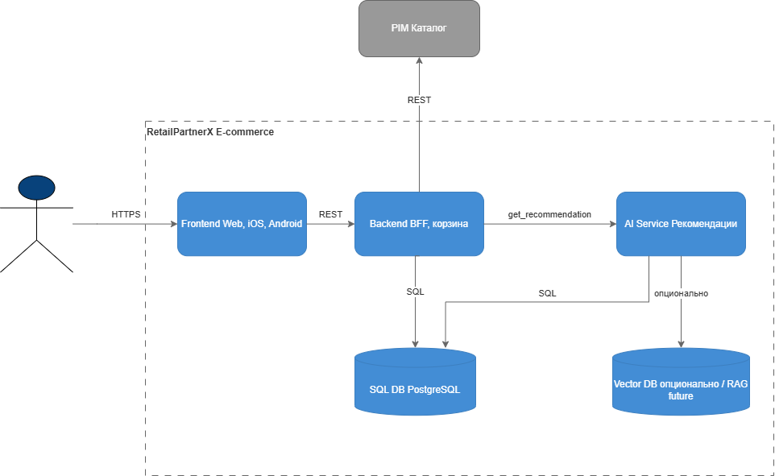
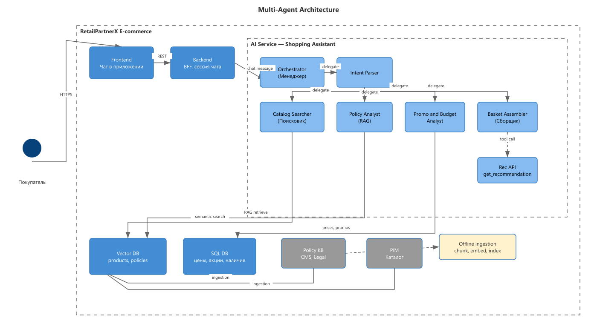

# RetailPartnerX — AI Architecture Case Study

> Учебный архитектурный кейс: персонализированные рекомендации и shopping assistant для FMCG-ритейлера

**HTML-презентация:** [portfolio/index.html](portfolio/index.html) · **GitHub:** [YuesIt17/yuit-docs-ai-architect](https://github.com/YuesIt17/yuit-docs-ai-architect)

---

## Кратко о проекте

**RetailPartnerX** — вымышленный FMCG-ритейлер с omnichannel-каналами. Заказчик формулирует цель как «персональные рекомендации как у Tesco / Carrefour», но без KPI, границ данных и каналов. Кейс прорабатывает архитектуру AI-native системы: от программы и рисков до C4, API, agentic RAG, data pipeline и production-readiness design.

Репозиторий развивается последовательно через учебные модули (`hw-1` … `hw-6`) как единый architecture case study. Физические имена папок сохранены для процесса сдачи курса.

**Что здесь есть:** architecture design, прототип LangGraph (stub без API keys), эксперименты и coursework. **Что здесь нет:** production deployment, реальная нагрузка, работающий стек Kafka / Vector DB / observability.

---

## Архитектурный фокус

| Направление | Суть |
|-------------|------|
| **Program & Risk** | Discovery, контракт PoC→MVP→Prod, AI-риски R1–R8, roadmap с DoD |
| **System Design (C4)** | Границы системы, контейнеры, компоненты AI Service, sequence flows |
| **Integration (OpenAPI)** | Контракт Backend ↔ AI Service: `POST /get_recommendation` |
| **Agentic RAG** | Supervisor multi-agent, dual KB (Product + Policy), LangGraph prototype |
| **Architecture Decisions** | ADR-001: SaaS LLM for PoC/MVP via LLM Client abstraction |
| **Data Architecture** | Kafka → Spark → S3 → Feature Store / Vector DB, anti-skew governance |
| **Production Readiness** | Security layer, RAG evaluation strategy, observability dashboard design |

---

## Architecture at a Glance

| Элемент | Описание |
|---------|----------|
| **Границы** | Frontend → Backend (BFF) → AI Service; внешние системы: PIM, CDP/CRM |
| **Хранилища** | SQL DB (история, каталог), Redis (кэш кандидатов), Vector DB (RAG) |
| **AI Service** | Ranker → Top-K → RAG + LLM re-rank; синхронный ответ на карточке товара |
| **Trust boundary** | Backend не знает ML-деталей — только OpenAPI-контракт |
| **NFR** | p95 latency как класс метрики (числовой SLO — после замеров MVP, см. [hw-2/diagrams/README.md](hw-2/diagrams/README.md)) |

Shopping assistant в чате приложения: Orchestrator координирует 6 специализированных агентов; Policy Analyst — semantic guard по Policy KB; Basket Assembler переиспользует recsys API из hw-2.

---

## Архитектурный путь

| Модуль | Архитектурный фокус | Основные артефакты |
|--------|---------------------|-------------------|
| [hw-1](hw-1/) | Программа, риски, roadmap | [RetailPartnerX_AI_Strategy.md](hw-1/RetailPartnerX_AI_Strategy.md) |
| [hw-2](hw-2/) | C4, Sequence, API-контракт | [diagrams/](hw-2/diagrams/), [recommendation-api.yaml](hw-2/openapi/recommendation-api.yaml) |
| [hw-3](hw-3/) | Agentic RAG, multi-agent, прототип | [agents.md](hw-3/docs/agents.md), [rag-pipeline.md](hw-3/docs/rag-pipeline.md), [code/](hw-3/code/) |
| [hw-4](hw-4/) | ADR: LLM hosting | [adr-001-llm-hosting.md](hw-4/docs/adr-001-llm-hosting.md) |
| [hw-5](hw-5/) | Data pipeline, Feature Store | [data-pipeline.md](hw-5/docs/data-pipeline.md), [diagram](hw-5/diagrams/data-pipeline.png) |
| [hw-6](hw-6/) | Security, Evaluation, Observability | [quality-assurance.md](hw-6/docs/quality-assurance.md), [security-layer.png](hw-6/diagrams/security-layer.png) |

---

## Ключевые архитектурные решения

| Решение | Контекст / Trade-off | Evidence |
|---------|---------------------|----------|
| **AI Service — отдельный контейнер** | Независимый релиз и масштаб ML/LLM vs сетевой hop | [hw-2/diagrams/README.md](hw-2/diagrams/README.md) §1 |
| **Ranker → Top-K → RAG/LLM** | Latency и cost control vs полный LLM на каталог | [hw-2/diagrams/README.md](hw-2/diagrams/README.md) §2, допущение A-001 |
| **Supervisor multi-agent (6 agents)** | SRP, изоляция Policy Analyst vs монолитный промпт | [hw-3/docs/agents.md](hw-3/docs/agents.md) |
| **SaaS LLM for PoC/MVP** | TTM и quality vs data residency / vendor lock-in | [hw-4/docs/adr-001-llm-hosting.md](hw-4/docs/adr-001-llm-hosting.md) |
| **Dual KB RAG (Product + Policy)** | Разные retrieval-стратегии vs смешение в одном индексе | [hw-3/docs/rag-pipeline.md](hw-3/docs/rag-pipeline.md) |
| **Kafka → Spark → Feature Store** | Training-serving consistency vs сложность pipeline | [hw-5/docs/data-pipeline.md](hw-5/docs/data-pipeline.md) |
| **Security Layer до LLM** | PII, prompt injection, output guardrails vs latency overhead | [hw-6/docs/quality-assurance.md](hw-6/docs/quality-assurance.md) §1 |

---

## Production Readiness

| Область | Статус | Что учтено | Evidence |
|---------|--------|------------|----------|
| **Security** | Архитектурный дизайн | PII Sanitizer, Input/Output Guardrails, Secret Manager, OWASP LLM | [hw-6](hw-6/docs/quality-assurance.md) |
| **Reliability** | Архитектурный дизайн + Studied | OpenAPI 503, graceful degradation в стратегии, timeout/retry patterns | [hw-2 OpenAPI](hw-2/openapi/recommendation-api.yaml), [hw-1](hw-1/RetailPartnerX_AI_Strategy.md) |
| **Evaluation** | Планируется | Faithfulness, Answer Relevancy; Ragas / DeepEval CI gates | [hw-6 §2](hw-6/docs/quality-assurance.md) |
| **Observability** | Планируется | Prometheus, Tempo, Langfuse, Grafana dashboard spec | [hw-6 §3](hw-6/docs/quality-assurance.md) |
| **Data** | Архитектурный дизайн | Ingestion, Feature Store, anti-skew, index versioning | [hw-5](hw-5/docs/data-pipeline.md) |
| **Platform** | Не реализовано | Deployment, K8s, CI/CD — не в scope репозитория | — |

---

## Enterprise / Retail Context

Архитектурные patterns кейса применимы к enterprise-retail задачам:

- **Product recommendations** — блок «С этим покупают» на карточке SKU с контролируемым latency-budget
- **Shopping assistant** — conversational commerce с constraint parsing (аллергены, бюджет, акции)
- **Policy compliance** — RAG по internal policies (GDPR, 18+, аллергены) как semantic guard
- **Knowledge freshness** — data pipeline для актуальности Product KB и embeddings

Это учебный кейс; patterns описаны как архитектурный подход, а не как описание реальных внутренних систем.

---

## Статус проекта

RetailPartnerX — **учебный архитектурный кейс**, развиваемый в рамках программы AI Architect.

Репозиторий содержит:

- architecture design (C4, ADR, data pipeline, security/eval/observability)
- прототип LangGraph (stub, keyword RAG, 7 pytest, без LLM API keys)
- coursework artifacts в `hw-*`

Цель — практическая проработка архитектуры AI-native систем и production-oriented trade-offs. **Проект не является production deployment.**

---

## Автор

**Евгений Юлов** · [LinkedIn](https://www.linkedin.com/in/eugene-yulov/)

Engineering Manager с 13+ годами опыта в IT / software development.

Профессиональный фокус:

- Solution Architecture
- Distributed Systems
- Platform Engineering
- AI Architecture (развиваемая специализация на базе system engineering background)

---

## Навигация

| Ресурс | Описание |
|--------|----------|
| [portfolio/index.html](portfolio/index.html) | HTML-презентация для architecture review |
| [hw-1 … hw-6](#архитектурный-путь) | Evidence по модулям |
| [docs/interview/INTERVIEW-SUMMARY.md](docs/interview/INTERVIEW-SUMMARY.md) | Краткая шпаргалка для собеседований |
| [docs/interview/ARCHITECTURE-INTERVIEW-CHEATSHEET.md](docs/interview/ARCHITECTURE-INTERVIEW-CHEATSHEET.md) | Общие темы Solution Architect |
