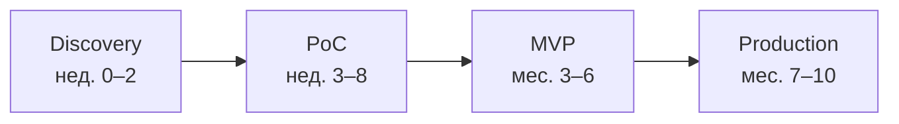
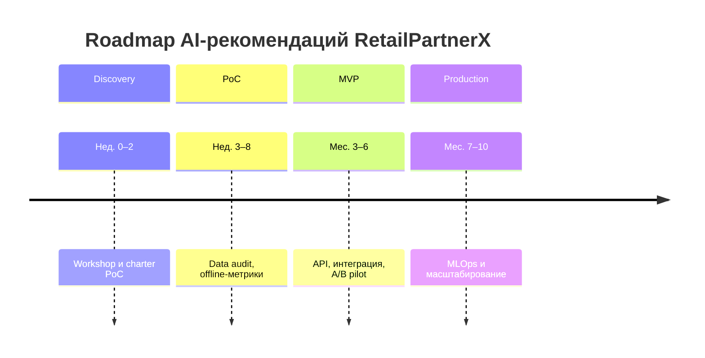

# Стратегия внедрения AI-рекомендаций для RetailPartnerX

> **Сокращения:** [Глоссарий сокращений](Glossary.md) (T&M, FP, NDCG@10, SLA и др.)

**Документ для согласования с заказчиком**  
Роль: архитектор решений, компания-интегратор  
Версия: 1.0

---

## Executive Summary

**RetailPartnerX** — международная компания в сфере розничной торговли продовольственными товарами, управляющая сетями магазинов. Заказчик хочет систему персонализированных рекомендаций, но формулирует требования как «хотим как у Tesco / Carrefour / X5 Digital», без конкретных KPI, границ данных и каналов.

Предлагаемый подход:

1. Снять неопределённость через **5–7 уточняющих вопросов** и discovery-workshop.
2. Провести **PoC** по модели **T&M with cap** (4–6 недель).
3. Выйти на **MVP** по **гибридной модели** (FP на интеграции и UI, T&M на ML/данные).
4. Масштабировать в **Production** с рамочным FP/SLA и ретейнером на MLOps.
5. Управлять **AI-специфичными рисками** через матрицу и план митигации.

Горизонт программы: **~10 месяцев** до стабильного production-контура.

---

## 1. Контекст и допущения

| Параметр | Значение |
|----------|----------|
| Заказчик | RetailPartnerX |
| Цель | Персонализированные рекомендации товаров |
| Исходные требования | Размытые, бенчмарк FMCG-ритейла (Tesco, Carrefour, X5 Digital) |
| Каналы (допущение) | Сайт, приложение, email/push (уточнить) |
| Команда интегратора | Архитектор, ML, data, backend, QA |
| Регуляторика | GDPR, 152-ФЗ (РФ), согласия на обработку ПДн |

---

## 2. Уточняющие вопросы клиенту (снятие неопределённости)

| № | Вопрос | Зачем задаём | Влияние на проект |
|---|--------|--------------|-------------------|
| 1 | **Какие KPI считаем успехом?** (CTR блока рекомендаций, конверсия в корзину/заказ, AOV, доля выручки с рекомендаций, retention) | Без метрик нельзя закрыть PoC и подписать FP на MVP | DoD PoC/MVP, контракт, приоритизация сценариев |
| 2 | **Где показываем рекомендации?** (главная, карточка товара, корзина, каталог, push/email) | Определяет scope интеграций и нагрузку | Roadmap MVP/Prod, оценка FP |
| 3 | **Какие данные доступны?** (события click/view/cart/purchase, единый customer ID, offline→online, глубина истории) | Качество данных — главный риск AI в ритейле | PoC: go/no-go; архитектура feature store |
| 4 | **Как обрабатываем cold start?** (новые пользователи, гости, новые SKU, регионы) | Влияет на выбор алгоритмов и baseline | MVP: сценарии fallback; метрики coverage |
| 5 | **Какие системы в контуре?** (PIM/каталог, CMS, CDP, CRM, anti-fraud, поиск) | Границы интеграции и ответственности сторон | FP scope, CR-триггеры |
| 6 | **NFR и compliance:** latency (p95), SLA, explainability, GDPR / 152-ФЗ, хранение логов | Production-ready требования | Prod DoD, риски compliance |
| 7 | **Кто владелец продукта и как принимаем модель?** (Product owner, комитет приёмки, A/B политика) | Governance и скорость релизов | Контракт, этап MVP pilot |

**Следующий шаг:** workshop 1–2 дня с RetailPartnerX → заполненная матрица ответов → уточнённый SOW PoC.

---

## 3. Контрактная модель

### 3.1. Уровень неопределённости

| Фактор | Статус |
|--------|--------|
| Бизнес-KPI | Не определены |
| Scope каналов | Частично |
| Качество/полнота данных | Не проверены |
| Архитектура ML | Не выбрана |
| Бенчмарк FMCG (Tesco / Carrefour / X5) | Не декомпозирован |

**Вывод:** неопределённость **высокая** → чистый FP на весь проект **не рекомендуется**.

### 3.2. Модель по этапам

| Этап | Модель | Scope (кратко) | Выгода RetailPartnerX | Выгода интегратора |
|------|--------|----------------|------------------------|---------------------|
| **PoC** | **T&M with cap** (потолок бюджета и срока) | 1–2 сценария, исторические данные, offline-метрики, отчёт go/no-go | Платит за проверку гипотезы, не за «чёрный ящик»; контроль cap | Не несёт риск неверной FP-оценки; гибкость итераций |
| **MVP** | **Гибрид:** FP на фиксированный интеграционный и UI-scope + **T&M** на ML/данные | 1 канал в prod, A/B или shadow, мониторинг, baseline | Предсказуемость по «коробке»; гибкость там, где итерации модели | Справедливое распределение риска; маржа на FP-части |
| **Production** | **Рамочный FP** на платформу + **SLA** + **ретейнер T&M** на retrain/улучшения | Все ключевые touchpoints, MLOps, SLO | Стабильная эксплуатация и масштаб | Долгосрочное сопровождение, CR на изменения |

### 3.3. Почему не чистый FP на старте

- Невозможно зафиксировать объём без аудита данных и пилотных метрик.
- AI-проекты требуют итераций; FP без CR приводит к конфликтам scope.
- PoC с cap снижает финансовый риск обеих сторон.

### 3.4. Черновик Change Request (для FP-частей MVP/Prod)

**CR инициируется**, если:

1. Добавлен новый источник событий или изменена схема ID клиента.
2. Изменены целевые KPI (±1 основная метрика).
3. Добавлено **>2** новых touchpoints или каналов.
4. Объём каталога/SKU вырос **>30%** без согласованного retrain pipeline.
5. Требования по latency/SLA ужесточены **>20%** от согласованного baseline.
6. Новые регуляторные требования (GDPR, 152-ФЗ, cross-border data).

**Процесс:** заявка → оценка impact (чел/дни, риск) → согласование доп. бюджета/срока → дополнение к SOW.

---

## 4. Оценка рисков

Оценка **качественная** (шкала Н / С / В) по методике матрицы рисков из материалов курса (`docs/Risk_Matrix_Example.xlsx`).

### 4.1. Расшифровка показателей P и I

| Показатель | Полное название | Что оцениваем | Как используется в документе |
|------------|-----------------|---------------|------------------------------|
| **P** | Probability (вероятность) | Насколько **вероятно**, что риск проявится на данном этапе проекта | Строка матрицы 3×3 (§4.3) |
| **I** | Impact (воздействие / ущерб) | Насколько **серьёзны последствия** для бизнеса, если риск уже случился | Столбец матрицы 3×3 (§4.3) |
| **Уровень** | Risk priority (приоритет риска) | Итог для планирования митигации: **Н** — наблюдение, **С** — контроль, **В** — активная митигация | Ячейка на пересечении P и I; **не** среднее арифметическое P и I |

**Шкала Н / С / В — критерии для P (вероятность):**

| Значение | Критерий (вероятность наступления) |
|----------|-----------------------------------|
| **Н** | Маловероятно при принятых мерах; нет типовых предпосылок в отрасли |
| **С** | Реалистично без специальных мер; встречается в похожих AI-проектах |
| **В** | Высокая вероятность по умолчанию на этапе; почти неизбежно без митигации |

**Шкала Н / С / В — критерии для I (воздействие):**

| Значение | Критерий (последствия для бизнеса) |
|----------|-------------------------------------|
| **Н** | Локальный сбой без влияния на KPI и compliance |
| **С** | Деградация UX, задержки релиза, доп. затраты на доработку |
| **В** | Срыв KPI, репутационный ущерб, штрафы, остановка пилота |

### 4.2. Обоснование оценок рисков (Basis of Estimate)

Баллы P и I в реестре §4.4 — **предварительная экспертная оценка** на этапе pre-discovery. Это не фактические метрики RetailPartnerX (аудит данных и workshop ещё впереди).

| Источник обоснования | Что учтено в оценке |
|--------------------|---------------------|
| **Допущения проекта (§1)** | Размытые требования, FMCG, omnichannel, регуляторика GDPR/152-ФЗ |
| **Контекст этапа** | PoC — фокус на данных; MVP — пилот и cold start; Prod — drift, нагрузка, MLOps |
| **Отраслевые паттерны** | Типовые риски recsys в grocery/FMCG (качество событий, cold start, сезонность SKU) |
| **Практика интегратора** | Накопленный опыт внедрений AI в ритейле до старта измерений у заказчика |
| **Методика курса** | Формат матрицы 3×3 и качественная шкала из `Risk_Matrix_Example.xlsx` |

**Статус оценок:** *Draft — subject to validation* после workshop (§2) и data audit в PoC; при изменении допущений — пересчёт P/I и уровней, при необходимости — количественная оценка (§4.5).

### 4.3. Качественная матрица 3×3

Легенда ячеек: **Н** — низкий приоритет, **С** — средний, **В** — высокий (требует плана митигации).

| P \\ I | Низкое воздействие (I=Н) | Среднее воздействие (I=С) | Высокое воздействие (I=В) |
|--------|--------------------------|---------------------------|---------------------------|
| **Низкая вероятность (P=Н)** | Н | С | С |
| **Средняя вероятность (P=С)** | С | С | **В** |
| **Высокая вероятность (P=В)** | С | **В** | **В** |

**Как получить «Уровень» для риска:** найдите в таблице ячейку на пересечении строки P и столбца I. Пример: R1 имеет P=**С**, I=**В** → ячейка **В**; R6 имеет P=**Н**, I=**В** → ячейка **С** (низкая вероятность, но высокий ущерб при инциденте).

### 4.4. Реестр рисков (AI-специфичные)

| ID | Риск | P | I | Уровень | Митигация | Владелец | Этап |
|----|------|---|---|---------|-----------|----------|------|
| R1 | Низкое качество/полнота поведенческих данных | С | В | **В** | Data audit в PoC; единый customer ID; договорённость по событиям | Data Lead RetailPartnerX | PoC |
| R2 | Cold start: новые пользователи и SKU | В | С | **В** | Popularity + content-based fallback; правила для гостей | ML Architect | MVP |
| R3 | Деградация модели (concept/data drift) | С | В | **В** | Мониторинг метрик online/offline; регламент retrain | MLOps | Prod |
| R4 | Нерелевантные/«токсичные» рекомендации (репутация, compliance) | С | В | **В** | Фильтры категорий, blocklists, human-in-the-loop на пилоте | Product + Legal | MVP |
| R5 | Latency inference в пик (распродажи) | С | С | **С** | Кэш, batch features, autoscaling, нагрузочные тесты | Platform | Prod |
| R6 | Несоответствие GDPR / 152-ФЗ / отсутствие согласий | Н | В | **С** | Privacy review; минимизация ПДн; псевдонимизация; DPIA по юрисдикциям | Legal / Security | PoC–Prod |
| R7 | Vendor lock-in внешнего LLM/API (если используется genAI) | С | С | **С** | Абстракция провайдера; self-hosted опция в roadmap | Architect | MVP |
| R8 | Галлюцинации / фактические ошибки genAI (описания товаров, чат-ассистент) | С | С | **С** | Запрет автопубликации без валидации; шаблоны + human review; guardrails и blocklists | Product + ML | MVP–Prod |

**Сводка по приоритетам:** четыре риска уровня **В** (R1–R4) — в фокус митигации на PoC/MVP; четыре уровня **С** (R5–R8) — контроль по мере выхода в prod и при использовании genAI.

### 4.5. Количественная оценка (следующий шаг)

После workshop рекомендуется перенести топ-5 рисков в реестр количественной оценки (шаблон ISAR: вероятность %, min/expected/max ущерб, лимит толерантности).

---

## 5. Дорожная карта (Roadmap)

### 5.1. Сводная таблица вех

| Веха | Срок | Цель | Ключевые deliverables | DoD (критерии успеха) | Контракт |
|------|------|------|----------------------|------------------------|----------|
| **Discovery** | Нед. 0–2 | Согласовать вопросы §2 | Матрица ответов, уточнённый scope | Подписан charter PoC | T&M / внутренний |
| **PoC** | Нед. 3–8 | Проверить гипотезу ценности | Pipeline на исторических данных; 1–2 сценария; offline-отчёт | NDCG@10 / HitRate@10 ≥ согласованного baseline **или** явный no-go с причинами | T&M with cap |
| **MVP** | Мес. 3–6 | Выход на пользователей | API рекомендаций; интеграция в 1 канал; A/B или shadow; dashboard | Статзначимый lift по primary KPI **или** parity + план улучшений; нет критических инцидентов 2 нед. | Гибрид FP+T&M |
| **Production** | Мес. 7–10 | Масштабирование | Все ключевые touchpoints; MLOps (retrain, alert); SLO | p95 latency ≤ целевого; uptime ≥ SLA; drift-alerts отрабатываются | FP + SLA + ретейнер |

### 5.2. Definition of Done по этапам

#### PoC
- [ ] Аудит данных: покрытие событий, % идентифицированных пользователей.
- [ ] Offline-метрики на hold-out: **NDCG@10**, **HitRate@10**, coverage.
- [ ] Сравнение с rule-based baseline.
- [ ] Документ **go/no-go** с рекомендацией scope MVP.

#### MVP
- [ ] Рекомендации в **одном** production-канале (например, карточка товара).
- [ ] **A/B** (5–10% трафика) или shadow mode ≥ 2 недели.
- [ ] Мониторинг: latency, error rate, business KPI daily.
- [ ] Runbook инцидентов и rollback.

#### Production
- [ ] Rollout на согласованные touchpoints (≥80% целевого трафика).
- [ ] MLOps: scheduled retrain, версионирование моделей, feature store SLA.
- [ ] SLO: availability, p95 latency, время восстановления.
- [ ] Квартальный review KPI с Product Owner RetailPartnerX.

### 5.3. Визуализации

**Фазы проекта:**

**План-график (недели и месяцы от T0, ~10 мес.):**

*T0 — согласованный старт программы; календарные даты не используются.*

---

## 6. План согласования с RetailPartnerX

| # | Действие | Срок | Результат |
|---|----------|------|-----------|
| 1 | Презентация данного документа | Нед. 1 | Общее согласие по подходу |
| 2 | Workshop по вопросам §2 | Нед. 1–2 | Заполненная матрица требований |
| 3 | Подписание SOW PoC (T&M with cap) | Нед. 2 | Старт PoC |
| 4 | Review go/no-go | Нед. 8 | Решение о MVP |
| 5 | Согласование гибридного контракта MVP + CR policy | Нед. 9–10 | Kick-off MVP |

---
