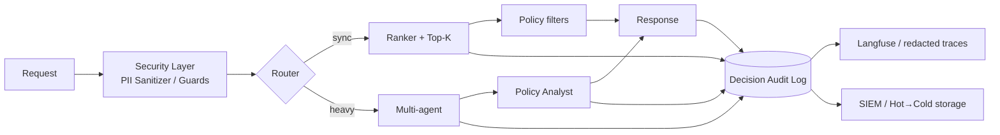

# Model Card & FinOps Report — RetailPartnerX

**Проект:** персонализированные рекомендации + shopping assistant  
**Этап:** Prod readiness (учебный architecture / governance design)  
**Связанные модули:** [hw-1 риски](../../hw-1/RetailPartnerX_AI_Strategy.md) · [hw-5 data](../../hw-5/docs/data-pipeline.md) · [hw-6 QA](../../hw-6/docs/quality-assurance.md) · [hw-7 cost](../../hw-7/docs/inference-sizing.md) · [hw-9 high-load](../../hw-9/docs/high-load-architecture.md)

> Это **учебный** Model Card и FinOps-сценарий, не отчёт реального облачного биллинга и не production compliance package. Цифры OpEx опираются на sizing hw-7 (ориентир авг 2026).

Структура Model Card опирается на [Hugging Face Model Cards](https://huggingface.co/docs/hub/model-cards) и фреймворк [Mitchell et al., 2018](https://arxiv.org/abs/1810.03993). FinOps-часть — на [FinOps Framework](https://www.finops.org/framework/) (Inform → Optimize → Operate).

---

## Содержание

1. [Часть 1. Model Card (Governance)](#sec-1)
2. [Часть 2. FinOps-отчёт (+50% к бюджету)](#sec-2)
3. [Сводка для сдачи](#sec-3)

---

<a id="sec-1" href="#sec-1"> </a>

## 1. Часть 1. Model Card (Governance)

### 1.0. Метаданные системы (YAML-стиль Hub)

```yaml
---
system_name: RetailPartnerX-AI-Recsys-Assistant
version: "1.0-mvp-design"
library_name: custom  # Ranker + RAG agents + LLM Client (не единый transformers-checkpoint)
pipeline_tag:
  - recommendation
  - conversational
base_model:
  - meta-llama/Meta-Llama-3-70B-Instruct   # self-hosted path (hw-7), INT4 + vLLM
  - proprietary-saas-llm                  # PoC/MVP per ADR-001 (hw-4)
datasets:
  - retailpartnerx/behavioral-events      # App/CDP clicks, carts, purchases (внутренний)
  - retailpartnerx/pim-catalog            # SKU attributes, allergens, age flags
  - retailpartnerx/policy-kb              # GDPR, 18+, allergen / promo policies
license: other
license_name: internal-retailpartnerx-research
language:
  - ru
  - en
tags:
  - retail
  - recommendations
  - rag
  - multi-agent
  - fairness
  - finops
---
```

**Расшифровка полей (как на Hub Metadata UI / YAML front matter):**

| Поле | Значение у нас | Зачем на Hub / в governance |
| ---- | -------------- | --------------------------- |
| `system_name` | `RetailPartnerX-AI-Recsys-Assistant` | Учебный аналог имени репо/модели; у нас — имя **системы**, не одного checkpoint |
| `version` | `1.0-mvp-design` | Версия карточки / design-freeze; в prod ↔ `model_uri` / registry (hw-8) |
| `library_name` | `custom` | На Hub — библиотека инференса (`transformers`, `vllm`…); у нас стек не один HF-loader |
| `pipeline_tag` | `recommendation`, `conversational` | Тип задачи для фильтров/виджетов Hub; у нас два продукта в одной системе |
| `base_model` | Llama-3-70B + SaaS LLM | Базовая LLM (fine-tune / quant / adapter); dual-path по ADR-001 (hw-4) и sizing (hw-7) |
| `datasets` | behavioral / PIM / policy-kb | Датасеты обучения и контекста; внутренние id, не публичные Hub datasets |
| `license` / `license_name` | `other` + internal… | Лицензия весов/артефактов; учебный internal, не open-source SPDX |
| `language` | `ru`, `en` | Языки интерфейса и контента каталога/ассистента |
| `tags` | см. ниже | Свободные метки для поиска и классификации на Hub |

**Теги:**

| Tag | Смысл для RetailPartnerX |
| --- | ------------------------ |
| `retail` | Домен: ритейл / omnichannel |
| `recommendations` | Сценарий Ranker → Top-K (± LLM re-rank) |
| `rag` | Policy Analyst / KB поверх retrieval (hw-3) |
| `multi-agent` | Orchestration shopping assistant (hw-3) |
| `fairness` | Bias / fairness slices и метрики (§1.4–1.5) |
| `finops` | Карточка связана с cost envelope и Optimize (§2) |

Карточка описывает **систему** (Ranker + Top-K + optional LLM re-rank + multi-agent assistant), а не один файл весов: для ритейла критичны routing, policy filters и данные каталога.

---

### 1.1. Model Details

| Поле | Значение |
| ---- | -------- |
| **Владелец** | RetailPartnerX (учебный кейс AI Architect) |
| **Компоненты** | (1) Collaborative / content Ranker; (2) Top-K candidate stage; (3) LLM re-rank / shopping assistant (Llama-3-70B INT4 или SaaS через LLM Client); (4) Policy Analyst (RAG по Policy KB) |
| **Входы** | `customer_id` / session, `sku_id` / query, channel, constraints (бюджет, аллергены) |
| **Выходы** | Список SKU + объяснение (assistant); structured recommendation payload (OpenAPI hw-2) |
| **Версионирование** | `model_uri` / `index_version` из Model Registry (hw-8); `policy_version` для Policy KB |

---

### 1.2. Intended Use

**Целевые сценарии (in-scope):**

1. Блок «С этим покупают» / персональные рекомендации на карточке SKU (`POST /get_recommendation`).
2. Shopping assistant в приложении: подбор корзины с учётом бюджета, промо, аллергенов и возрастных ограничений.
3. Semantic guard по внутренним политикам (Policy Analyst) — **рекомендация к отказу/замене**, не юридическая консультация.

**Пользователи:** покупатели omnichannel-каналов RetailPartnerX; операторы пилота (human review на MVP).

**Ожидаемая ценность:** рост conversion / AOV при контролируемых latency, cost и compliance (R4, R6, R8 из hw-1).

---

### 1.3. Limitations (Out of Scope)

| Ограничение | Почему важно |
| ----------- | ------------ |
| **Не медсовет / не диетолог** | Аллергены и диеты — по атрибутам PIM + Policy KB; ошибки данных каталога возможны |
| **Не замена Legal / GDPR officer** | Ассистент не даёт юридических заключений; минимизация ПДн — процесс + PII Sanitizer (hw-6) |
| **Не для несовершеннолетних без parental policy** | SKU 18+ должны отфильтровываться Policy Analyst; при сбое фильтра — инцидент R4 |
| **Cold start** | Новые пользователи/SKU получают popularity / content-based fallback (R2); качество ниже personalization |
| **Не автономный закупщик** | Нет автосписания денег / автозаказа без подтверждения пользователя |
| **Качество = данные** | При дырах в CDP/PIM (R1) рекомендации деградируют; Model Card не «чинит» data quality |
| **Язык / регион** | Eval и fairness-срезы сейчас заложены для RU-магазинов и основных категорий FMCG; другие рынки — отдельный slice |

**Явный запрет:** использование скоров рекомендера как единственного основания для дискриминации сотрудников, ценовой дискриминации protected classes или скрытого таргетинга уязвимых групп без Legal review.

---

### 1.4. Training Data & Bias Analysis

#### 1.4.1. Источники данных

| Датасет | Содержание | Роль | Риски bias |
| ------- | ---------- | ---- | ---------- |
| **Behavioral events** (Kafka ← App/CDP) | view / click / cart / purchase | Обучение Ranker, online features | Перекос в «активных» пользователях приложения; боты; столичные регионы |
| **PIM catalog** | SKU, категории, цена, аллергены, 18+ | Content features, RAG Product KB | Неполные аллергены → unsafe suggestions; бренд-перекос ассортимента |
| **Policy KB** | GDPR, 18+, аллергены, промо-правила | Policy Analyst | Устаревшая policy_version → ложный «ok» |
| **LLM base weights** | Llama-3-70B / SaaS pretrained corpus | Генерация текста / re-rank | Общие LLM-biases (стереотипы, англоцентричность) поверх retail data |

Обучение Ranker — offline на point-in-time joins Feature Store (hw-5), без «заглядывания» в будущее. Embeddings Product KB — batch после curated catalog.

#### 1.4.2. Анализ предвзятости (Bias analysis)

| Гипотеза bias | Как проявляется | Митигация | Evidence / контроль |
| ------------- | --------------- | --------- | ------------------- |
| **Popularity bias** | Топ-SKU вытесняют long-tail и локальные бренды | Diversity re-rank, exploration quota, отдельная метрика long-tail exposure | Offline: catalog coverage @K; online: share of long-tail impressions |
| **Channel / digital divide** | Пользователи только offline-магазинов слабо представлены в CDP | Unified customer ID; fallback popularity по магазину/региону | Доля сессий без digital history; R1 audit |
| **Geographic skew** | Москва/крупные города доминируют в кликах | Стратифицированный train sample; per-region eval slices | Δ NDCG@K между регионами |
| **Category / gender proxy** | Косвенная стереотипизация корзин (уход, детское и т.п.) | Запрет явных sensitive features; slice-метрики; Legal review | Fairness dashboard (ниже) |
| **Age-restricted leakage** | 18+ в рекомендациях несовершеннолетним / без age-gate | Policy Analyst + hard filter до ответа | Zero-tolerance online alert |
| **Allergen under-reporting** | Рекомендация при заявленной аллергии | Constraint Parser + PIM flags + Policy RAG | Safety eval set; human review 1–2% (hw-6) |
| **LLM stereotype bleed** | Тексты ассистента усиливают стереотипы | Output Guardrails; шаблоны; запрет автопубликации без валидации (R8) | Toxicity / stereotype probes в CI |

**Честный вывод:** данные FMCG-кликов **не нейтральны**. Model Card фиксирует это как управляемый риск, а не как «модель без bias».

---

### 1.5. Fairness Metrics

Классические classification-метрики (equalized odds) для multi-class recommender адаптируем к **retail slices**. Целевые пороги — design-time; калибровка после замеров MVP.

| Метрика | Определение (для RetailPartnerX) | Срезы | Целевой порог (MVP design) |
| ------- | -------------------------------- | ----- | -------------------------- |
| **Regional parity gap** | \|NDCG@10_region − NDCG@10_global\| | федеральные округа / кластеры магазинов | ≤ 0.05 |
| **Long-tail exposure** | Доля impressions на SKU вне top-20% по продажам | канал app / web | ≥ 15% при сохранении CTR ≥ baseline−10% |
| **Cold-start regret** | Отношение CTR новых vs returning users | new vs returning | CTR_new ≥ 0.7 × CTR_returning (с popularity fallback) |
| **Age-gate violation rate** | Доля ответов с 18+ SKU без age-ok | assistant + recsys | **0** (блокер релиза) |
| **Allergen conflict rate** | Рекомендации, конфликтующие с заявленным constraint | assistant | **0** на safety eval set; online ≈ 0 + alert |
| **Demographic proxy gap*** | Δ CTR / conversion между сегментами, где сегмент — *прокси* (не PII-профиль) | bucket по магазину/формату, не по protected class напрямую | мониторинг + escalation в Legal при устойчивом разрыве >15% |

\*RetailPartnerX **не строит** fairness на сырых protected attributes в фичах Ranker; используем operational slices и Legal-процесс (R6).

**Связь с eval hw-6:** Faithfulness / Answer Relevancy остаются для RAG-ответов; fairness — ортогональный слой (кто получает какую полезность), не замена quality gates.

---

<a id="sec-1-6" href="#sec-1-6"> </a>

### 1.6. Архитектура аудита решений AI

Компетенция курса: не только «карточка», но и **логирование решений** для разбора инцидентов и compliance.



**Минимальный schema audit event (без сырых ПДн):**

| Поле | Пример | Зачем |
| ---- | ------ | ----- |
| `request_id`, `ts` | uuid, ISO time | корреляция |
| `channel`, `scenario` | `pdp_recsys` / `assistant` | срез FinOps + fairness |
| `model_uri`, `index_version`, `policy_version` | registry ids | воспроизводимость |
| `candidate_ids` (hashed/sku) | top-K до re-rank | почему эти товары |
| `rank_scores` | float[] | отладка Ranker |
| `llm_used` | bool + model id | cost + right-sizing |
| `policy_verdict` | `ok` / `block` / `substitute` | R4/R8 |
| `guardrail_flags` | injection, pii_masked, toxicity | hw-6 |
| `fairness_slice_ids` | region_bucket, new_user | offline fairness jobs |
| `latency_ms`, `token_in/out`, `cost_est` | numbers | FinOps unit economics |

PII в трейсы не попадает (PII Sanitizer → redacted Langfuse). TTL и классы хранения — в §2.3 (FinOps).

---

### 1.7. Ethical Considerations (кратко)

- Рекомендации влияют на рацион, бюджет семьи и доступность товаров — **высокий consumer impact**.
- Ошибки по аллергенам / 18+ — safety, не «метрика чуть хуже».
- Прозрачность: Model Card + audit log — минимум для внутреннего review; публичный consumer-facing disclosure — решение Legal/Product.
- Human-in-the-loop на пилоте (R4): выборочный review ассистента до расширения автономии.

---

<a id="sec-2" href="#sec-2"> </a>

## 2. Часть 2. FinOps-отчёт (+50% к бюджету)

### 2.0. Контекст бюджета (учебный сценарий)

Опора на hw-7: целевой GPU-контур **2×A100 INT4 + vLLM ≈ 464k ₽/мес** (Yandex / Cloud.ru). Для Prod-envelope закладываем также CPU/API, Object Storage, логи/трейсы, Vector DB, staging.

| Статья (план) | Бюджет, ₽/мес | Комментарий |
| ------------- | ------------: | ----------- |
| GPU inference (prod, 2×A100) | 464 000 | сценарий C hw-7 |
| GPU / VM non-prod (staging, experiments) | 80 000 | ожидался schedule off-hours |
| Object Storage + Feature/Lake | 40 000 | S3 raw/curated |
| Observability (логи, трейсы, Langfuse volume) | 35 000 | sampling 1–2% |
| Vector DB + Redis + прочее | 31 000 | ANN + cache |
| **Итого бюджет** | **650 000** | утверждённый FinOps envelope |

**Факт месяца:** счёт **975 000 ₽** → **+50%** к бюджету (**+325 000 ₽**).

Фазы FinOps ([Framework](https://www.finops.org/framework/)): сначала **Inform** (разбор счёта), затем **Optimize** (техплан), далее **Operate** (алерты, ownership, unit economics).

---

<a id="sec-2-1" href="#sec-2-1"> </a>

### 2.1. Inform — разбор превышения

| Статья | План | Факт | Δ | Типичная причина |
| ------ | ---: | ---: | -: | ---------------- |
| GPU prod | 464k | 520k | +56k | рост LLM RPS: Ranker-запросы уходили в 70B; слабый Semantic Cache hit-rate |
| GPU non-prod | 80k | 210k | **+130k** | **забытые GPU-инстансы** (ночные fine-tune / demo ноды 24×7) |
| Storage + logs | 75k | 165k | **+90k** | **неэффективное хранение логов**: full prompt/completion DEBUG без TTL, hot storage |
| Vector / Redis / misc | 31k | 80k | +49k | раздутые индексы, несколько копий Product KB |
| **Итого** | **650k** | **975k** | **+325k** | |

---

### 2.2. Типичные причины (root causes)

#### A. Забытые GPU-инстансы (≈ 40% overrun)

- Staging и «одноразовый» fine-tune кластер оставлены on-demand на весь месяц.
- Нет auto-shutdown / TTL на namespace `experiments`.
- Нет FinOps tag `owner` / `ttl_date` → никто не получает anomaly alert.

#### B. Неэффективное хранение логов (≈ 28% overrun)

- Langfuse / Tempo / object logs писали **полные** промпты на 100% трафика вместо 1–2% sample (hw-6 design).
- Retention 90+ дней в hot tier; нет перехода Glacier/Cold.
- Дубли: app logs + LLM traces + audit с одинаковым payload.

#### C. Слишком «умная» модель для простых задач (≈ 17% overrun + часть prod GPU)

- Sync path `/get_recommendation` часто вызывал Llama-3-70B re-rank там, где достаточно Ranker + Top-K (антипаттерн к latency-budget hw-2 и high-load hw-9).
- Нет cost-aware routing: `llm_used=true` по умолчанию для «качества на всякий случай».

#### D. Вторичные эффекты (≈ 15%)

- Несколько версий Vector DB индекса без GC.
- Отсутствие Spot для batch embedding / offline eval.
- Рост egress при выгрузке трейсов.

---

<a id="sec-2-3" href="#sec-2-3"> </a>

### 2.3. Optimize — план Cost Optimization

Конкретные **технические** меры (не «попросить скидку у облака»). Оценка экономии — порядок величины к текущему факту 975k → целевой коридор **≈ 550–620k ₽/мес** при сохранении SLO.

| # | Мера | Что сделать в архитектуре | Ожидаемый эффект | Trade-off качество/риск |
| - | ---- | ------------------------- | ---------------- | ----------------------- |
| 1 | **Spot / preemptible GPU** | Batch: embeddings, offline eval, distillation train — на Spot; prod sync inference остаётся on-demand (или Spot+fallback pool) | −40–70% на non-prod/batch GPU → порядка **−80…120k ₽** | Прерывания job; нужен checkpoint + retry |
| 2 | **Model Distillation** | Teacher 70B → Student 7–8B (или ranker-only) для: (a) простого re-rank, (b) Intent Parser; 70B только для сложных assistant turns | −30–50% LLM GPU/token на «простых» → **−50…90k ₽** | Нужен regression eval (Faithfulness, NDCG); Canary hw-8 |
| 3 | **TTL и lifecycle данных** | Audit/traces: hot 7д → warm 30д → delete/cold 90д; raw lake: lifecycle rules; Semantic Cache TTL как в hw-9; запрет DEBUG prompts в prod | **−70…100k ₽** на storage/observability | Короче окно forensic; критичные инциденты — отдельный legal hold |
| 4 | **Cost-aware routing** | Политика: sync recsys → Ranker/Top-K; LLM re-rank только если `confidence < τ` или VIP-сегмент; assistant — cascade small→large | **−40…70k ₽** prod GPU | Редкий edge-case без LLM re-rank; мониторить CTR/NDCG |
| 5 | **Semantic Cache + KEDA (уже hw-9)** | Поднять hit-rate θ-тюнингом; scale-to-zero async workers | снижает LLM RPS | Устаревший кэш → жёсткая инвалидация по `index_version` |
| 6 | **Right-size non-prod** | Schedule: GPU staging 09–21; idle shutdown 1ч; квоты namespace | **−100…130k ₽** vs «забытые» GPU | Меньше удобства для ночных экспериментов → очередь job |
| 7 | **INT4 + vLLM discipline** | Не откатываться на FP16 «для качества» в prod без ADR | удерживает базу hw-7 | Eval gate на quality drop |

**Суммарно (консервативно):** возврат в бюджетный коридор **650k** и запас **≈ 5–15%** за 1–2 спринта Optimize.

```text
Факт 975k
  − Spot/batch & non-prod hygiene   ≈ 120k
  − TTL / log lifecycle             ≈  90k
  − Distillation + routing          ≈ 100k
  − Cache / index GC                ≈  40k
────────────────────────────────────────
Цель ≈ 625k  (в пределах бюджета 650k)
```

---

### 2.4. Operate — ownership, алерты, unit economics

| Практика FinOps | Внедрение в RetailPartnerX |
| --------------- | -------------------------- |
| **Everyone takes ownership** | Tag: `team`, `env`, `ttl_date` на каждом GPU/node pool |
| **Timely data** | Ежедневный cost report + anomaly (>120% дневного run-rate) |
| **Unit economics** | Grafana/Langfuse: ₽ / recommendation, ₽ / assistant turn, tokens / turn (виджеты hw-6) |
| **Central enablement** | FinOps + Platform задают квоты; Product утверждает quality floor |
| **Variable cost model** | Spot для batch; scale-to-zero для async workers (KEDA) |

**Action plan (2 недели):**

| День | Действие | Owner |
| ---- | -------- | ----- |
| 0–1 | Выключить/помечатить orphan GPU; inventory с `ttl_date` | Platform |
| 1–3 | Lifecycle TTL на logs/traces; sampling 1–2% | Platform + MLOps |
| 3–7 | Routing policy: LLM off by default на sync path | ML Architect |
| 5–10 | Запуск distillation PoC + eval gate | ML + QA |
| 7–14 | Spot queues для embedding/eval; cost dashboards + alerts | Platform + FinOps |

---

<a id="sec-2-5" href="#sec-2-5"> </a>

### 2.5. Зрелость: баланс цена ↔ качество

| Решение | Когда экономим | Когда **не** экономим |
| ------- | -------------- | --------------------- |
| Distillation / smaller model | Intent parse, простой re-rank, FAQ-like turns | Сложный multi-constraint assistant, инциденты качества |
| Spot GPU | Embeddings, train, overnight eval | Единственная реплика sync inference без fallback |
| Реже LLM на sync path | Высокий Ranker confidence, кэш hit | Падение NDCG/CTR на Canary, жалобы на «глупые» рекомендации |
| Короткий TTL логов | DEBUG/промпты | Legal hold, security incident, fairness investigation window |
| Резать Policy / Guardrails | **Никогда** ради костов | — |

**Принцип:** FinOps максимизирует **business value**, а не минимизирует счёт любой ценой ([FinOps principles](https://www.finops.org/framework/)). Для RetailPartnerX quality floor = age-gate 0 нарушений + allergen safety + NDCG/CTR в пределах Canary rollback (hw-8). Всё, что выше floor и жрёт GPU «на всякий случай», — кандидат на Optimize.

---

<a id="sec-3" href="#sec-3"> </a>

## 3. Сводка для сдачи

| Критерий курса | Где закрыто |
| -------------- | ----------- |
| Этика: Model Card, риски предвзятости | §1.2–1.5, §1.7 |
| Экономика: конкретные техмеры | §2.3 (Spot, Distillation, TTL, routing, cache) |
| Зрелость: цена ↔ качество | §2.5 |
| Audit logging решений | §1.6 |

> **Сокращения:** [Глоссарий](../Glossary.md)
