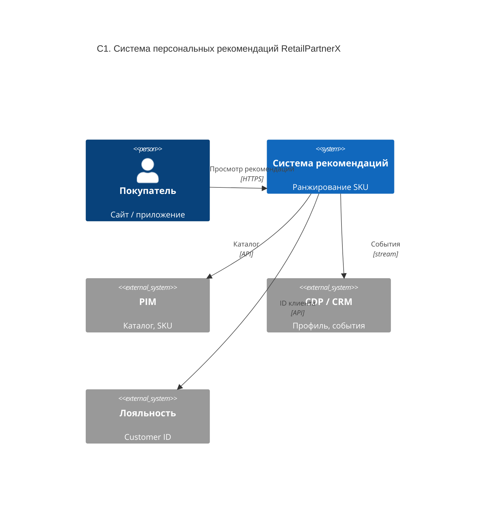

# C1 — Context (RetailPartnerX)

> **Уровень:** C1 Context · **Статус:** опционально (компетенция), полезно перед C2

Система рекомендаций в окружении заказчика: покупатель, внешние PIM, CDP и программа лояльности.

## Связанные диаграммы

| Далее | Файл |
|-------|------|
| Контейнеры | [c2-containers.md](c2-containers.md) |

## Подписи на связях (полный текст для отчёта)

| От → к | На диаграмме | Расшифровка |
|--------|----------------|-------------|
| Покупатель → Система | Просмотр рекомендаций [HTTPS] | Просматривает рекомендации по HTTPS |
| Система → PIM | Каталог [API] | Загрузка каталога SKU |
| Система → CDP | События [stream] | Профиль и поведенческие события |
| Система → Лояльность | ID клиента [API] | Идентификатор в программе лояльности |
