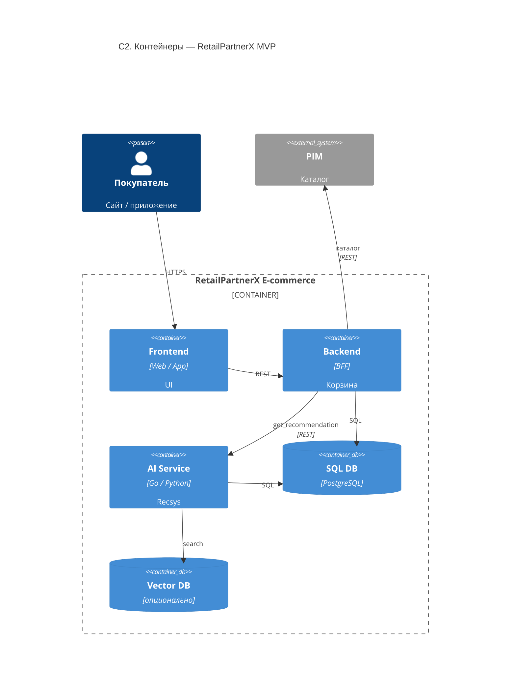

# C2 — Container (RetailPartnerX)

> **Уровень:** C2 Container · **Обязательно в ДЗ**

Deployable-контейнеры MVP: Frontend, Backend, AI Service, SQL DB, Vector DB.

## Связанные диаграммы

| Детализация | Файл |
|-------------|------|
| Компоненты AI Service (MVP) | [c3-ai-service-recsys.md](c3-ai-service-recsys.md) |
| RAG (future) | [c3-ai-service-rag-future.md](c3-ai-service-rag-future.md) |
| Контекст | [c1-context.md](c1-context.md) |

