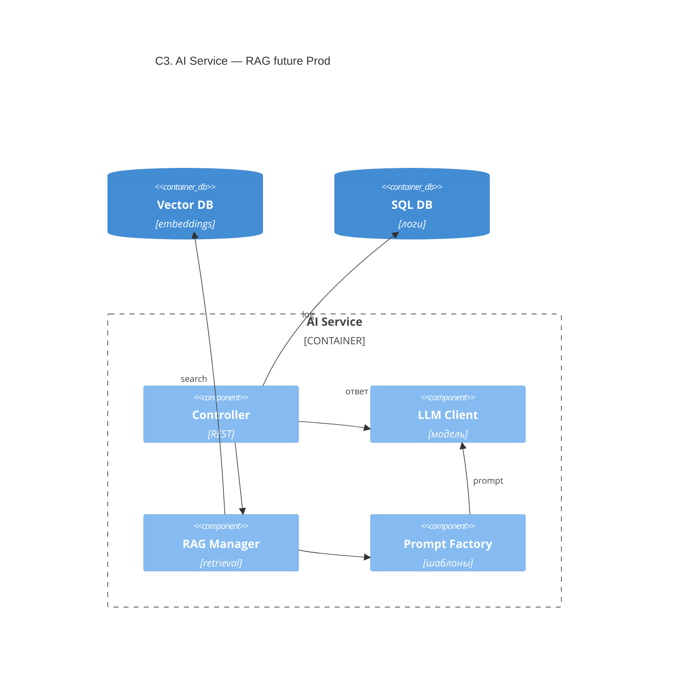

# C3 — AI Service (RAG + LLM, future)

> **Уровень:** C3 Component · **Статус:** Prod / genAI, **не** в Sequence MVP

Компоненты из ДЗ: Controller, RAG Manager, LLM Client, Prompt Template Factory.

## Связанные диаграммы

| MVP (recsys) | [c3-ai-service-recsys.md](c3-ai-service-recsys.md) |
| Контейнеры | [c2-containers.md](c2-containers.md) |

