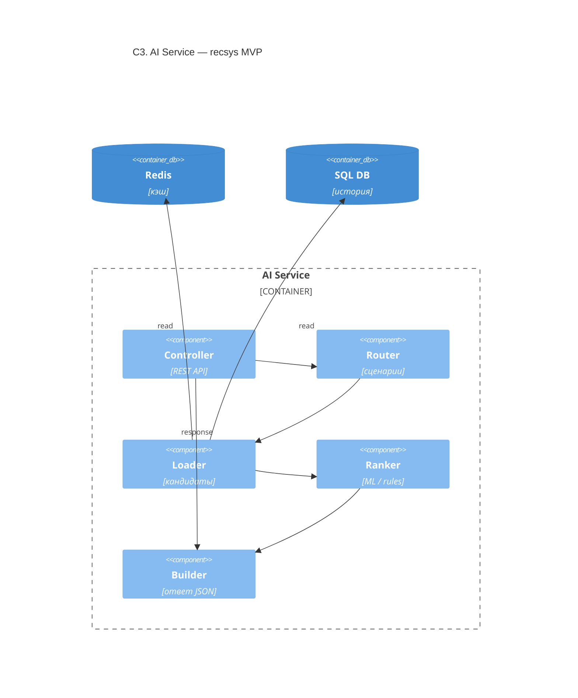

# C3 — AI Service (recsys, MVP)

> **Уровень:** C3 Component · **Обязательно в ДЗ** · **Связность:** Sequence + OpenAPI

Внутренняя структура контейнера **AI Service** для PoC/MVP (без RAG).

## Связанные артефакты

| Артефакт | Файл |
|----------|------|
| Sequence | [sequence-get-recommendation.md](sequence-get-recommendation.md) |
| OpenAPI | [recommendation-api.yaml](../../openapi/recommendation-api.yaml) |
| Контейнеры | [c2-containers.md](c2-containers.md) |

