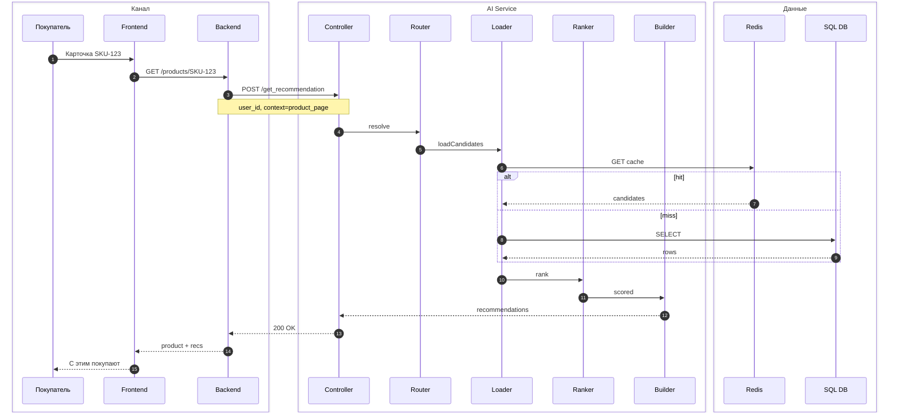

# Sequence — запрос рекомендации

> **Сценарий:** карточка товара (happy path) · **Обязательно в ДЗ**

Участники в **box**-группах совпадают с [c3-ai-service-recsys.md](c3-ai-service-recsys.md). API: [recommendation-api.yaml](../../openapi/recommendation-api.yaml).

## Связанные артефакты

| Артефакт | Файл |
|----------|------|
| C3 recsys | [c3-ai-service-recsys.md](c3-ai-service-recsys.md) |
| OpenAPI | [recommendation-api.yaml](../../openapi/recommendation-api.yaml) |
| Draw.io | [sequence-get-recommendation.drawio](../drawio/sequence-get-recommendation.drawio) |

