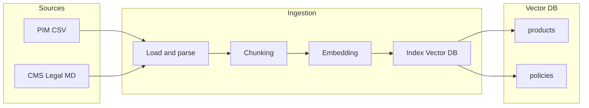
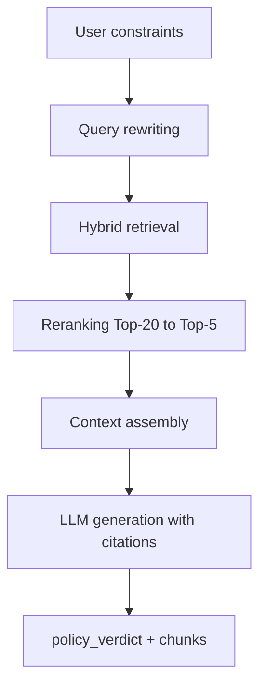

# Шаг 3: RAG Flow

Кейс: RetailPartnerX · агенты: [agents.md](agents.md) · Vector DB из [hw-2](../../hw-2/diagrams/README.md)

## 3.1 Источники знаний

| Корпус | Содержимое | Хранение | Потребитель |
|--------|------------|----------|-------------|
| **Product KB** | Название, состав, категория, атрибуты SKU | Vector DB, коллекция `products` | Catalog Searcher |
| **Policy KB** | Аллергены, правила акций, GDPR-тексты, guideline «что нельзя рекомендовать» | Vector DB, коллекция `policies` | Policy Analyst, Promo Analyst |

Policy KB закрывает риски **R4, R6, R8** из [hw-1](../../hw-1/RetailPartnerX_AI_Strategy.md).

## 3.2 Ingestion pipeline (offline)



### Загрузка

- **Товары:** экспорт PIM → CSV/JSON (`sku_id`, `title`, `description`, `ingredients`, `category`, `allergens[]`).
- **Политики:** Markdown/PDF из CMS/Legal (`policy_id`, `doc_type`, `jurisdiction`, `effective_date`, `body`).

### Чанкинг

| Корпус | Стратегия | Размер | Overlap | Метаданные |
|--------|-----------|--------|---------|------------|
| **Политики** | По заголовкам разделов (`##`) | 300–500 токенов | 50–80 токенов | `doc_type`, `jurisdiction`, `effective_date`, `policy_id` |
| **Товары** | 1 SKU = 1 документ | «название + состав + категория» (~100–200 токенов) | 0 | `sku_id`, `category`, `allergens[]` |

Инструменты: `RecursiveCharacterTextSplitter` (LangChain) для политик; фиксированный шаблон для SKU.

### Эмбеддинг

- Модель: `multilingual-e5-base` или `text-embedding-3-small` (поддержка RU).
- **Отдельные коллекции** `products` и `policies` — разная плотность терминов и разный reranking threshold.
- Нормализация векторов (cosine similarity).

### Индексация

- **Vector DB:** pgvector / Qdrant / Pinecone.
- Индексы: HNSW для `products` (высокий QPS), IVF для `policies` (меньший объём, выше точность).
- Версионирование индекса: `index_version` в метаданных для rollback.

### Опционально: Knowledge Graph

Узлы и рёбра для pre-filter до vector search:

- `SKU --has_allergen--> gluten`
- `Promo --applies_to--> Category`
- `Policy --governs--> Category`

Граф в Neo4j или property graph в PostgreSQL; Policy Analyst сначала фильтрует по графу, затем dense retrieval.

## 3.3 Query pipeline (online, Policy Analyst)



### 1. Query rewriting

Orchestrator передаёт структурированный запрос:

```text
ограничения: без глютена; категория: паста; контекст: ужин на 4 персоны
```

### 2. Hybrid retrieval

| Метод | Назначение | Top-N |
|-------|------------|-------|
| **Dense** (vector) | Семантика «безглютеновые альтернативы» | 20 |
| **Sparse** (BM25) | Точные юридические формулировки («глутен», «аллерген») | 20 |
| **Fusion** (RRF) | Объединение списков | 20 |

Фильтры по метаданным: `doc_type=policy_allergen`, `effective_date <= today`.

### 3. Reranking

- Cross-encoder: `BAAI/bge-reranker-v2-m3` (multilingual).
- Top-20 → Top-5 чанков; порог `score < 0.35` → fallback «уточните у консультанта» (R8).

### 4. Context assembly

Prompt Template Factory (имя из hw-2 C3) собирает:

```text
[POLICY_CHUNKS]
- {policy_id}: {chunk_text}
...
[CONSTRAINTS]
{dietary_constraints}
[QUESTION]
Можно ли рекомендовать следующие категории товаров?
```

### 5. Generation + citation

- LLM возвращает `verdict: allow | deny | clarify` + `cited_policy_ids[]`.
- Логирование chunks и verdict для GDPR audit (hw-1, R6).

## 3.4 Catalog Searcher RAG (Product KB)

Упрощённый online-пайплайн для товаров:

1. Query = «паста без глютена» + фильтр `category IN (...)` из Intent Parser.
2. Vector search в `products`, Top-10.
3. SQL post-filter: `price <= budget`, `in_stock = true`.
4. Без reranking на MVP прототипе; в Production — тот же cross-encoder.

## 3.5 NFR

| Требование | Решение |
|------------|---------|
| Latency чата | Асинхронный режим: multi-step loop 5–15 с (в отличие от синхронного блока карточки hw-2) |
| Audit | Лог `retrieval_chunks[]`, `policy_verdict`, `index_version` |
| Drift политик | Scheduled re-ingestion при обновлении CMS; alert при `effective_date` change |

## 3.6 Связь с архитектурой

На схеме [multi-agent-architecture](../diagrams/multi-agent-architecture.drawio):

`Policy KB (CMS/Legal)` → offline ingestion → `Vector DB / policies` → **Policy Analyst** → Orchestrator.
