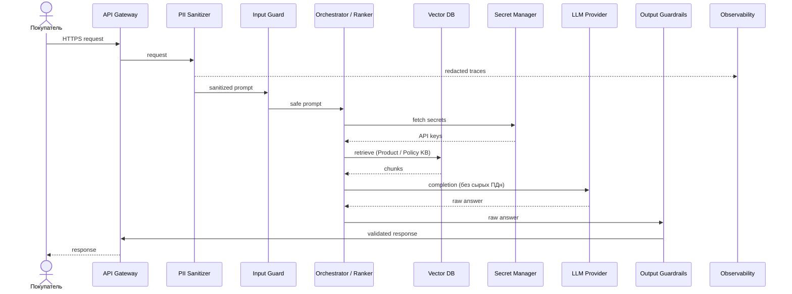
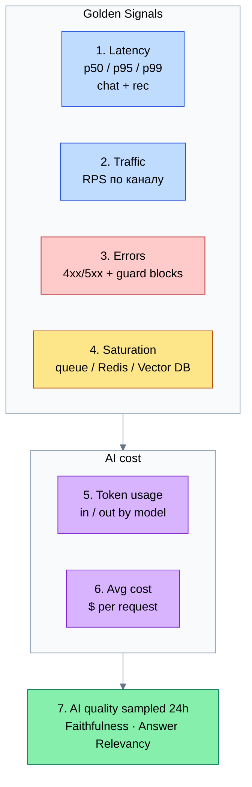

# Quality Assurance — RetailPartnerX

**Проект:** персонализированные рекомендации + шопинг-ассистент  
**Этап:** MVP → Prod readiness  
**Схема Security:** [diagrams/security-layer.drawio](../diagrams/security-layer.drawio) · [PNG](../diagrams/security-layer.png)

Связь с предыдущими ДЗ: риски **R4 / R6 / R8** ([hw-1](../../hw-1/RetailPartnerX_AI_Strategy.md)); AI Service / `POST /get_recommendation` ([hw-2](../../hw-2/diagrams/README.md)); агенты + Policy Analyst / Guardrails ([hw-3](../../hw-3/docs/agents.md)); хостинг LLM ([hw-4](../../hw-4/README.md)); свежесть Product KB ([hw-5](../../hw-5/docs/data-pipeline.md)).

## 1. Security Layer

Цель: усилить путь чата и рекомендаций компонентами **PII Sanitizer**, **Input Guard** (Prompt Injection), **Output Guardrails** и **Secret Manager** — до того, как ответ попадёт пользователю или промпт уйдёт во внешний LLM.

### Компоненты на схеме

| Компонент | Где в потоке | Что делает | Риски / OWASP |
| --------- | ------------ | ---------- | ------------- |
| **API Gateway** | Вход | AuthN, rate limit, TLS | Abuse / DoS |
| **PII Sanitizer** | До LLM | Маскирует `customer_id`, ФИО, телефон, адрес, email в промпте и трейсах | **R6**, LLM02 Sensitive Information Disclosure |
| **Input Guard** | После sanitize | Детект / блокировка Prompt Injection, jailbreak, попыток «игнорируй политику» | **LLM01 Prompt Injection** |
| **Orchestrator + агенты** | Ядро (hw-3) / Ranker (hw-2) | Бизнес-логика; секреты только через Secret Manager | — |
| **Output Guardrails** | После LLM | Citations к RAG-чанкам, blocklist (18+, токсичность), отказ при низком score | **R4, R8**, LLM05 Improper Output Handling |
| **Secret Manager** | Вне кода | API keys LLM / Vector DB; ротация | LLM10 Model Theft / credential leak |
| **Observability (redacted)** | Параллельно | Трейсы без сырых ПДн (Langfuse + Prometheus) | R6 |

### Последовательность (happy path)

Компонентная схема — в [security-layer.png](../diagrams/security-layer.png). Ниже — порядок вызовов на одном запросе чата / рекомендации.

Policy Analyst (hw-3) остаётся semantic-guard по Policy KB; **Output Guardrails** — технический валидатор ответа (schema, blocklist, grounding check) на границе сервиса.

## 2. Testing Strategy (RAG quality)

Оцениваем качество **шопинг-ассистента** (Policy KB + Product KB) и, отдельно, релевантность ответов Ranker там, где есть genAI-объяснения. Для сравнения LLM (SaaS vs self-host из hw-4) фиксируем один gold-набор сценариев.

### Метрики RAG

| Метрика | Что измеряет | Зачем RetailPartnerX |
| ------- | ------------ | -------------------- |
| **Faithfulness** | Ответ опирается на retrieved chunks, без выдуманных фактов | Анти-галлюцинации по SKU, аллергенам, акциям (**R8**) |
| **Answer Relevancy** | Ответ соответствует вопросу пользователя | «Собери ужин без глютена…» — не уводит в нерелевантные SKU |
| **Context Precision** (доп.) | В Top-K мало «шума» | Качество Product/Policy retrieval после hw-5 embedding pipeline |
| **Context Recall** (доп.) | Нужные факты попали в контекст | Аллергены / политики не «потерялись» |

Инфраструктурные метрики (CPU, RAM) **не заменяют** эти оценки качества.

### Инструмент

**Ragas** (primary) + опционально **DeepEval** для CI-гейтов:

| Слой | Инструмент | Как используем |
| ---- | ---------- | -------------- |
| Offline eval / сравнение LLM | **Ragas** | Датасет из 30–50 диалогов (happy path + adversarial: injection, аллергены); метрики выше; A/B двух LLM |
| CI / regression | **DeepEval** (или Ragas в pytest) | Порог Faithfulness ≥ 0.85, Answer Relevancy ≥ 0.8 на smoke-наборе перед релизом агентов |
| Online (prod) | Сэмпл + human review | 1–2% трейсов в Langfuse → разметка; алерт при падении скользящего Faithfulness |

**Gold-сценарии (минимум):** бюджетный ужин без глютена; отказ без `personalization_consent` (R6); Prompt Injection «игнорируй аллергены»; SKU с устаревшей акцией (связь с hw-5 freshness).

## 3. Observability (Grafana dashboard)

Стек: **Prometheus** (метрики) + **Tempo**/OTel (traces) + **Langfuse** (LLM traces, cost) → виджеты в **Grafana**.

### Список виджетов дашборда «AI Service — RetailPartnerX»

| # | Виджет | Источник | SLO / зачем |
| - | ------ | -------- | ----------- |
| 1 | **Latency** — p50 / p95 / p99 `POST /get_recommendation` и chat turn | Prometheus / Tempo | NFR latency; деградация Ranker / LLM |
| 2 | **Traffic** — RPS по endpoint / каналу (карточка vs чат) | Prometheus | Нагрузка, capacity |
| 3 | **Errors** — 4xx/5xx, доля blocked Input Guard / Output Guardrails | Prometheus | Инциденты, ложные срабатывания guard |
| 4 | **Saturation** — queue depth Orchestrator, Redis / Vector DB util | Prometheus | Узкие места до OOM / таймаутов |
| 5 | **Token usage** — tokens in/out per request, by model | Langfuse → Prometheus | Стоимость и лимиты провайдера |
| 6 | **Avg cost per request** — $ / turn (LLM + embedding batch amort.) | Langfuse | Unit economics MVP→Prod |
| 7 | **AI quality (sampled)** — rolling Faithfulness / Answer Relevancy | Eval job → Prometheus | Не CPU: качество ответов модели |

### Мокап раскладки (Grafana)

| Ряд | Смысл |
| --- | ----- |
| 1–4 | Golden Signals (SRE) |
| 5–6 | Cost / tokens (Langfuse) |
| 7 | Качество ответов модели (не CPU) |

Алерты (минимум): p95 latency > SLA; error rate > 2%; cost/request spike ×2; Faithfulness ниже порога 2 часа подряд.

> **Сокращения:** [Глоссарий](../Glossary.md)
