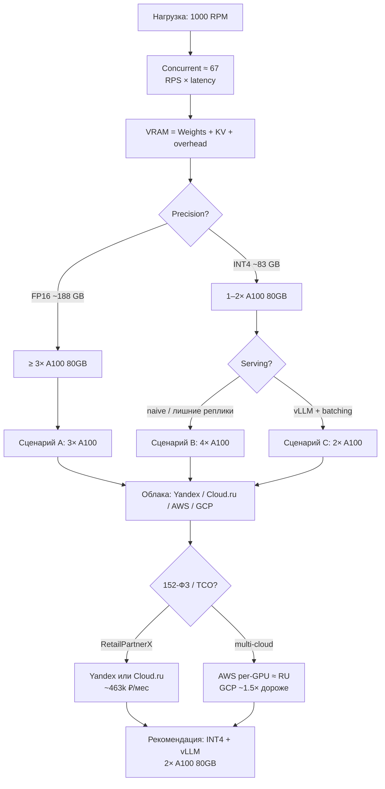

# Inference sizing — Llama-3-70B @ 1000 RPM

> **RetailPartnerX** · учебный capacity / cost для self-hosted shopping assistant  
> Краткий вывод: [recommendation.md](recommendation.md) · ADR: [hw-4](../../hw-4/docs/adr-001-llm-hosting.md)

## TL;DR — рекомендация

| | |
| --- | --- |
| **Стек** | Llama-3-70B **INT4** (AWQ/GPTQ) + **vLLM** |
| **Железо** | **2× NVIDIA A100 80GB** |
| **Облако** | **Yandex Cloud** или **Cloud.ru** (~463–464k ₽/мес GPU) |
| **Почему не GCP** | A100 80GB ~**1.5×** дороже (~704k ₽ за 2×) |
| **Почему не AWS «в лоб»** | цена per-GPU близка, но A100 часто только **пакетом 8×** (~1.9M ₽) |
| **Не брать** | **T4** под 70B @ 1000 RPM; FP16 — только для eval |

## Карта решения

Цепочка sizing (цифры — в таблицах ниже):



---

## Содержание

1. [Допущения](#1-допущения)
2. [VRAM](#2-vram--weights--kv-cache--overhead)
3. [Подбор GPU](#3-подбор-gpu)
4. [Сценарии для стоимости](#4-сценарии-для-стоимости)
5. [Облака: прайс](#5-облака-прайс)
6. [Стоимость сценариев](#6-стоимость-сценариев-мес)
7. [Оптимизации](#7-оптимизации-batching--vllm)
8. [Источники](#8-источники)

Цены — ориентир **авг 2026**, on-demand, **только GPU** (без дисков/egress). FX: **1 USD = 95 ₽**. Месяц = **730** ч.

---

## 1. Допущения

| Параметр | Значение | Зачем |
| -------- | -------- | ----- |
| Модель | Meta Llama-3-70B Instruct | Self-hosted из ADR-001 roadmap |
| Нагрузка | **1000 RPM** ≈ **16.7 RPS** | Задание |
| `seq_len` | **2048** токенов | prompt + RAG + ответ |
| p95 latency | **~4 с** | класс NFR hw-2 |
| Concurrent | **≈ 67** | Little: `RPS × latency` |
| Overhead | **5 GB** / реплика | CUDA / activations |

**KV Cache (GQA):** `n_layers=80`, `n_kv_heads=8`, `head_dim=128`  
→ `2 × 80 × 8 × 128 × 2 B = 327 680 B` ≈ **0.3125 MB / token**

---

## 2. VRAM = Weights + KV Cache + overhead

```text
Weights_GB = N_params × bytes_per_param / 1e9
KV_GB      = (0.3125 / 1024) × seq_len × concurrent
VRAM_GB    = Weights_GB + KV_GB + Overhead_GB
```

### Веса

| Precision | Байт / param | Weights |
| --------- | ------------ | ------- |
| **FP16** | 2 | **140.0 GB** |
| **INT4** | 0.5 | **35.0 GB** |

### KV при seq_len=2048, concurrent=67

| Метрика | Расчёт | Итог |
| ------- | ------ | ---- |
| На 1 запрос | 2048 × 0.3125 MB | **0.64 GB** |
| На 67 concurrent | 67 × 0.64 | **≈ 42.9 GB** |

### Итого

| Режим | Weights | KV | Overhead | **Σ VRAM** |
| ----- | -------: | --: | --------: | ---------: |
| FP16 | 140.0 | 42.9 | 5.0 | **≈ 187.9 GB** |
| INT4 | 35.0 | 42.9 | 5.0 | **≈ 82.9 GB** |

> **INT4** режет веса в **4×**, но KV при высокой concurrency остаётся крупным. PagedAttention / KV FP8 дают доп. запас (см. §7).

---

## 3. Подбор GPU

| GPU | VRAM | Роль |
| --- | ---- | ---- |
| A100 80GB | 80 GB | основной candidate |
| A100 40GB | 40 GB | INT4 + multi-GPU |
| L4 | 24 GB | INT4, TP ≥ 2 |
| T4 | 16 GB | не для 70B @ 1000 RPM |

### FP16 (нужно ≈ 188 GB)

| Конфиг | Σ VRAM | Статус | Комментарий |
| ------ | -----: | ------ | ----------- |
| 2× A100 80GB | 160 GB | ❌ нет | не хватает ~28 GB на KV |
| **3× A100 80GB** | 240 GB | ✅ OK | **baseline FP16** |
| 4× A100 40GB | 160 GB | ❌ / впритык | как 2×80 |
| L4 / T4 | — | ❌ | слишком много карт |

### INT4 (нужно ≈ 83 GB)

| Конфиг | Σ VRAM | Статус | Комментарий |
| ------ | -----: | ------ | ----------- |
| 1× A100 80GB | 80 GB | ⚠️ впритык | OK при concurrent ~55 или KV FP8 |
| **2× A100 80GB** | 160 GB | ✅ **рекомендуем** | запас под batching |
| 2× L4 | 48 GB | ❌ | 35 + 43 > 48 |
| 4× L4 | 96 GB | ✅ альтернатива | ниже memory BW |
| 6× T4 | 96 GB | ❌ не рекоменд. | слабый throughput |

**Вывод:** FP16 → минимум **3× A100 80GB**. INT4 → **2× A100 80GB** для prod @ 1000 RPM.

> VRAM necessary, но не sufficient: при ~200 output tok/req ориентир **~3300 tok/s** на кластер. С vLLM INT4 на 1–2×A100 типично **~800–1500 tok/s** → для 1000 RPM часто нужны 2–4 эффективные «слота», не одна карта впритык.

---

## 4. Сценарии для стоимости

| ID | Сценарий | GPU | Назначение |
| -- | -------- | --- | ---------- |
| **A** | FP16 baseline | **3× A100 80GB** | память без сильного batching |
| **B** | INT4 conservative | **4× A100** (2 шарды × 2) | перестраховка по throughput |
| **C** | INT4 + vLLM | **2× A100 80GB** | **целевой** |
| **D** | INT4 на L4 | **8× L4** | без A100 |

---

## 5. Облака: прайс

### Сводка — 1× A100 80GB / мес

| Облако | ≈ ₽ / GPU·мес | Относительно RU |
| ------ | ------------: | --------------- |
| Cloud.ru | **~232k** | baseline |
| Yandex Cloud | **~232k** | паритет |
| AWS (доля p4de ÷ 8) | **~238k** | ≈ то же |
| **GCP** (`a2-ultragpu-1g`) | **~352k** | **+~50%** |

### Yandex Cloud

Источник: [Compute pricing](https://yandex.cloud/en/docs/compute/pricing)

| GPU | $/час | ≈ ₽/час | ≈ ₽/мес |
| --- | ----: | ------: | ------: |
| A100 | **3.345** | 318 | **232 000** |
| T4 | **0.576** | 55 | **40 000** |
| L4 | — | — | нет в той же таблице |

### Cloud.ru (Evolution, с НДС)

Источник: [GPU products](https://cloud.ru/products/vychislitelnyye-moschnosti-s-gpu)

| Конфиг | ₽/час | ≈ ₽/мес |
| ------ | ----: | ------: |
| 1× A100 80GB | **317.20** | **231 600** |
| 2× A100 80GB | **634.40** | **463 100** |
| 1× A100 40GB | **256.20** | **187 000** |
| L4 (оценка) | **~220** | **~160 600** |

### AWS (us-east-1)

Источник: [EC2 on-demand](https://aws.amazon.com/ec2/pricing/on-demand/)

| GPU | Ориентир | ≈ ₽/мес на 1 GPU |
| --- | -------- | ---------------: |
| A100 80GB | $27.45 ÷ 8 (`p4de`) ≈ **$3.43**/GPU·ч | **~238 000** |
| A100 40GB | $21.96 ÷ 8 (`p4d`) ≈ **$2.75** | **~191 000** |
| L4 | `g6.xlarge` **$0.80–0.98** | **~55–68k** |
| T4 | `g4dn.xlarge` **~$0.53** | **~37 000** |

> **Caveat:** A100 на AWS обычно **пакет 8 GPU**. Для «ровно 2×A100» — недогруз узла или другой SKU (L4 и т.п.).

### Google Cloud

Источник: [Accelerator-optimized](https://cloud.google.com/products/compute/pricing/accelerator-optimized)

| GPU / VM | $/час | ≈ ₽/мес |
| -------- | ----: | ------: |
| A100 80GB `a2-ultragpu-1g` | **~5.07** | **~352 000** |
| A100 40GB `a2-highgpu-1g` | **~3.67** | **~255 000** |
| L4 `g2-standard-4` | **~0.70** | **~49 000** |

На GCP удобно взять **1× A100** без 8-GPU SKU, но **дороже** RU / AWS per-GPU.

---

## 6. Стоимость сценариев / мес

| Сценарий | GPUs | Yandex | Cloud.ru | AWS* | GCP |
| -------- | ---: | -----: | -------: | ---: | --: |
| A · FP16 | 3× A100 | **696k** | **695k** | **714k** | **1 056k** |
| B · INT4 conservative | 4× A100 | **928k** | **926k** | **952k** | **1 408k** |
| **C · INT4 + vLLM** | **2× A100** | **464k** | **463k** | **476k** | **704k** |
| D · INT4 L4 | 8× L4 | н/д | **~1 285k** est. | **~440–544k** | **~392k** |

\*AWS — *эффективная* доля GPU. Реальный минимум **8× A100** (p4de) для C ≈ **~1.9M ₽/мес**.

**Выбор для RetailPartnerX:** Yandex ≈ Cloud.ru по цене; плюс **152-ФЗ / data residency**. AWS/GCP — если multi-cloud и нет требования резидентности.

---

## 7. Оптимизации (Batching / vLLM)

| Техника | Эффект | Оценка |
| ------- | ------ | ------ |
| **INT4** (AWQ/GPTQ) | веса 140 → 35 GB | уход с 3×A100 FP16 на 2×A100 |
| **Continuous batching** | выше GPU util | **+1.5–3×** throughput |
| **vLLM PagedAttention** | меньше фрагментации KV | **+20–40%** concurrent |
| **KV FP8** (опц.) | KV ÷ ~2 | ещё **+10–20%** запас |

| Путь | GPU | ₽/мес (Cloud.ru) | vs A |
| ---- | --- | ---------------: | ---- |
| A · FP16 | 3× A100 | ~695k | 100% |
| **C · INT4 + vLLM** | **2× A100** | **~463k** | **≈ −33%** |
| B · INT4 без vLLM | 4× A100 | ~926k | хуже |

**Прогноз экономии:** C vs A → **~30–40% OpEx**; C vs B → до **~50%**.

---

## 8. Источники

| Тема | Ссылка |
| ---- | ------ |
| VRAM calculator | [HF Space](https://huggingface.co/spaces/NyxKrage/LLM-Model-VRAM-Calculator) |
| Llama 3.1 memory | [HF blog](https://huggingface.co/blog/llama31) |
| Yandex | [Compute pricing](https://yandex.cloud/en/docs/compute/pricing) |
| Cloud.ru | [GPU](https://cloud.ru/products/vychislitelnyye-moschnosti-s-gpu) |
| AWS | [EC2 on-demand](https://aws.amazon.com/ec2/pricing/on-demand/) |
| GCP | [Accelerator pricing](https://cloud.google.com/products/compute/pricing/accelerator-optimized) |

---

## Итог

Self-hosted **Llama-3-70B INT4 + vLLM** на **2× A100 80GB** в **Yandex Cloud / Cloud.ru** (~**0.46M ₽/мес** GPU) — рабочий TCO-якорь для пересмотра ADR-001 при росте нагрузки до 1000 RPM.

Дублирующий one-pager: [recommendation.md](recommendation.md).
