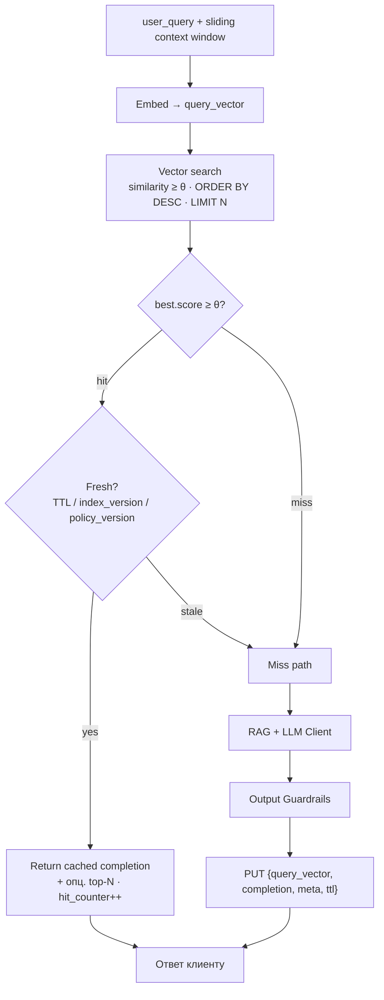
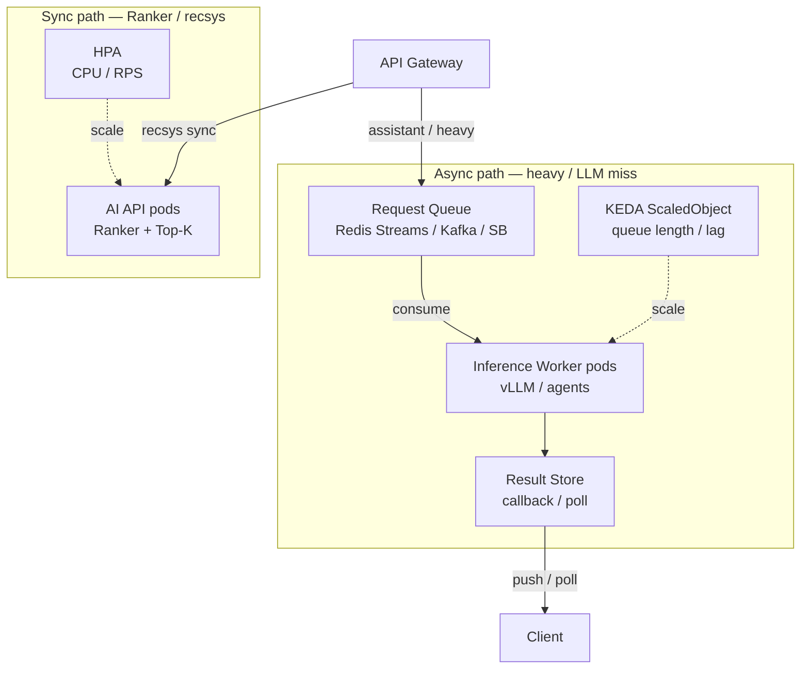
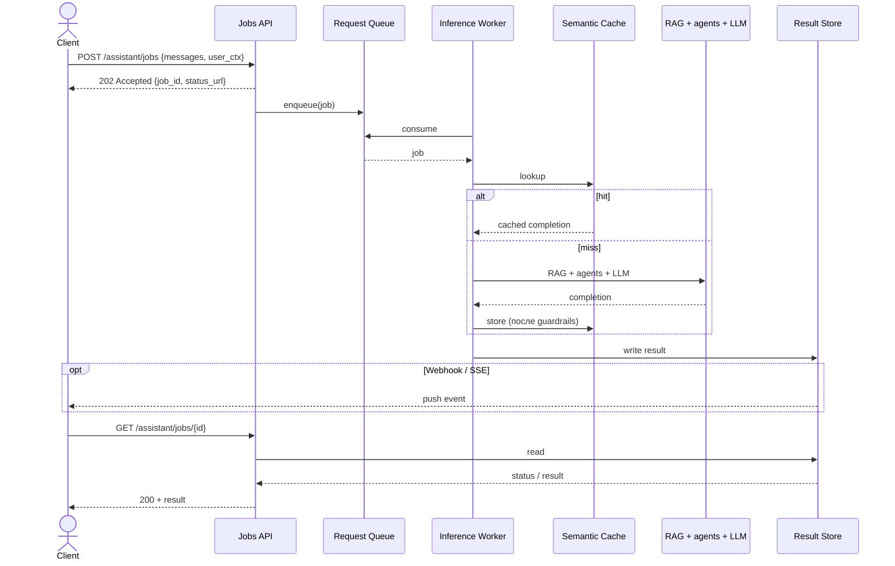
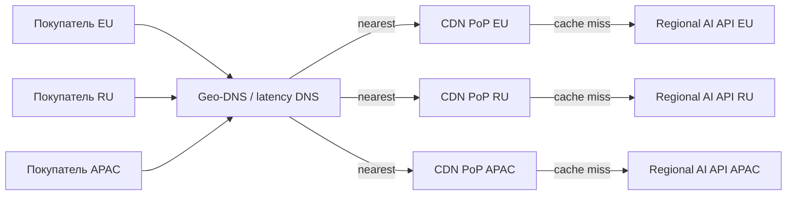
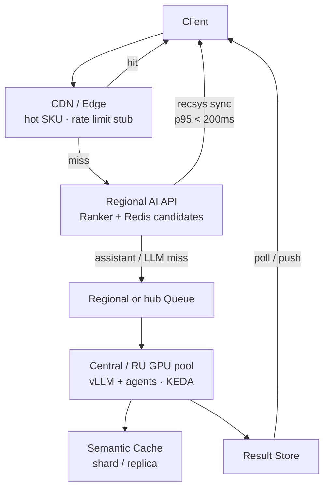
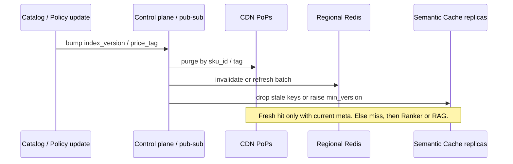
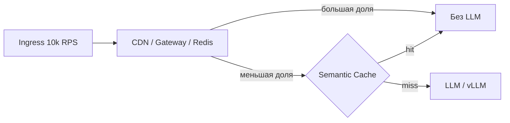

# High-Load Architecture — RetailPartnerX

**Проект:** персонализированные рекомендации + шопинг-ассистент  
**Этап:** Prod scale-out (учебный architecture design)  
**Целевые NFR:** **10 000 RPS**, **p95 latency &lt; 200 ms** на синхронном пути  
**Схема:** [diagrams/high-load-architecture.drawio](../diagrams/high-load-architecture.drawio) · [PNG](../diagrams/high-load-architecture.png)

Связь с предыдущими ДЗ: latency-budget A-001 и Redis кандидатов ([hw-2](../../hw-2/diagrams/README.md)); multi-agent assistant ([hw-3](../../hw-3/docs/agents.md)); LLM Client ([hw-4](../../hw-4/docs/adr-001-llm-hosting.md)); embeddings / Vector DB ([hw-5](../../hw-5/docs/data-pipeline.md)); метрики ([hw-6](../../hw-6/docs/quality-assurance.md)); GPU sizing ([hw-7](../../hw-7/docs/recommendation.md)); K8s/GitOps ([hw-8](../../hw-8/docs/delivery-pipeline.md)).

> Это **учебный** дизайн high-load, не production deployment и не замер реальных 10k RPS. Цель — показать, *как* удержать latency при росте нагрузки за счёт кэша, масштабирования inference и async.

---

## 0. Разделение путей (ключевое допущение)

| Путь | API / сценарий | RPS-доля (оценка) | Latency SLO | Модель обработки |
| ---- | -------------- | ----------------- | ----------- | ---------------- |
| **Sync hot path** | `POST /get_recommendation` (карточка SKU) | ~85–95% трафика | **p95 &lt; 200 ms** | Синхронно; кэш + Ranker; LLM редко |
| **Async heavy path** | Shopping assistant (multi-agent, длинный RAG) | ~5–15% | Accept + poll / push; completion секунды OK | Queue → workers → callback |

**Почему 10k RPS ≠ 10k LLM calls:** без кэша и Top-K даже 2×A100 (hw-7 @ 1000 RPM ≈ 17 RPS LLM) физически не вытянут. High-load стратегия = **отсечь LLM** на большинстве запросов, а оставшийся LLM-трафик — через очередь и KEDA.

---

## 1. Caching Strategy

Многоуровневый кэш: каждый слой режет RPS до следующего.

### 1.1. Где кэшируем

| Слой | Что хранит | Hit → эффект | TTL / инвалидация |
| ---- | ---------- | ------------ | ----------------- |
| **CDN (Edge)** | Статика фронта; опц. анонимные/популярные карточки «С этим покупают» (короткий TTL) | Снимает RPS с origin | TTL 30–120 s; purge по `sku_id` при смене каталога |
| **API Gateway** | Идемпотентные ответы по ключу `(sku_id, segment, channel)` для recsys | Меньше нагрузки на AI Service | TTL 15–60 s; не кэшировать PII/персональный deep-profile без сегмента |
| **Redis — candidates / features** (hw-2) | Precomputed кандидаты Ranker, hot features | Sync path без SQL/Feature Store на каждом hit | Batch refresh из Feature Store (hw-5); TTL + version key |
| **Semantic Cache** (Redis + vector index / Cosmos-style) | Embedding(query + context) → LLM completion | Пропуск LLM при похожем намерении | Similarity threshold + TTL; см. алгоритм ниже |

Security layer (hw-6) остаётся **перед** Semantic Cache hit на user-facing ответе: кэшируем уже прошедший Output Guardrails текст (или помечаем `guardrail_ok=true`).

### 1.2. Алгоритм Semantic Cache

Опирается на [Semantic Cache для LLM](https://learn.microsoft.com/ru-ru/azure/cosmos-db/gen-ai/semantic-cache): ключ — не строка, а **вектор** запроса (и контекста).

**Почему нужен context window:** без истории «Что второе по величине?» матчится с чужой беседой и отдаёт неверный кэш (пример из документации Microsoft). Для RetailPartnerX: кэшируем **последовательность** реплик ассистента (аллергены → бюджет → «собери корзину»), а не одиночную фразу.

**Порог θ (similarity):**
- слишком высокий → частые miss → кэш раздувается, LLM не разгружается;
- слишком низкий → нерелевантные ответы.

Стартовая гипотеза для кейса: **θ ≈ 0.88–0.92**, калибровка по offline-набору «похожих» вопросов из логов (после MVP). Метрики: `semantic_cache_hit_rate`, `llm_calls_saved`, `false_hit_rate` (ручная/eval выборка).

**Эффект на нагрузку LLM:** при hit-rate 40–60% на повторяющихся FAQ/политиках/типовых корзинах число вызовов LLM падает пропорционально — это единственный реалистичный способ приблизиться к 10k RPS при GPU-бюджете hw-7.

### 1.3. Что *не* кладём в Semantic Cache

- Персональные ответы с сырыми ПДн (только после PII Sanitizer; предпочтительно кэш по сегменту/анонимизированному ключу).
- Ответы, завязанные на мгновенные stock/price без `price_version` / `stock_snapshot_id` в meta.
- Policy-ответы после смены `policy_index_version` без инвалидации.

---

## 2. Scaling — горизонтальное масштабирование Inference + KEDA

### 2.1. Почему Kubernetes + KEDA, а не «чистый» Serverless

| Вариант | Плюсы | Минусы для RetailPartnerX |
| ------- | ----- | ------------------------- |
| **Serverless (Functions / cloud run без GPU pool)** | Простой scale-to-zero для лёгкого API | Холодный старт бьёт по &lt;200 ms; GPU LLM плохо ложится на short-lived functions |
| **Kubernetes + KEDA** (выбор кейса) | Hot GPU pool (hw-7/8), scale по **очереди**, Canary/GitOps уже есть | Сложнее ops; нужен ScaledObject и метрики |

**Решение:** оркестрация **Managed Kubernetes** (hw-8). API/BFF и Ranker-sync — Deployment + HPA (CPU/RPS). **Inference workers** (LLM/vLLM, тяжёлый RAG assistant) — Deployment + **KEDA** по глубине очереди запросов ([KEDA](https://keda.sh/)).

### 2.2. Схема масштабирования

**Метрика KEDA:** число сообщений в очереди (или consumer lag) / `threshold` = целевая «нагрузка на один под». Пример политики (учебная):

| Параметр | Значение-гипотеза |
| -------- | ----------------- |
| `minReplicaCount` | 2 (warm GPU, без cold start на пике) |
| `maxReplicaCount` | по квоте GPU node group (hw-7/8) |
| Trigger | Redis Lists / Streams **или** Kafka lag **или** Azure Service Bus |
| `queueLength` threshold | N pending msgs per pod (калибровка по p95 processing time) |
| Scale-to-zero | только off-peak для *дополнительных* async workers; базовый LLM pool — нет |

KEDA работает **рядом с HPA**, не заменяя его: HPA — ресурсный запас API; KEDA — event-driven для inference ([архитектура KEDA](https://keda.sh/)).

### 2.3. Как это выдерживает рост

1. Рост recsys RPS → CDN/Gateway/Redis hits → мало новых подов.
2. Рост LLM miss / assistant → очередь растёт → KEDA добавляет inference-поды.
3. Backpressure: при `maxReplica` и полной очереди — 503 / retry-after на heavy path; sync path изолирован (отдельный пул / priority).

---

## 3. Async Processing (Queue-based)

### 3.1. Когда уходим в async

| Запрос | Sync? | Причина |
| ------ | ----- | ------- |
| `/get_recommendation` без LLM или с cache hit | Да | Укладывается в &lt;200 ms |
| Короткая переранжировка Top-K (малый prompt) | Да, с жёстким timeout | Иначе soft-degrade без LLM (только Ranker) |
| Multi-agent shopping assistant (6 агентов, dual KB) | **Async** | Секунды LLM+RAG; нельзя держать HTTP &lt;200 ms |
| Batch re-embed / offline | Async (уже hw-5/8) | Не user-facing hot path |

### 3.2. Контракт async (EDA)

**Паттерны:** Command Queue, Competing Consumers, Idempotency-Key на `job_id`, DLQ для poison messages, correlation-id из hw-6 observability.

Sync и async **разделяют** ресурсы: очередь heavy не должна вытеснять Ranker-поды (отдельные Deployments / PriorityClass / отдельные GPU node pools).

---

## 4. Global Distribution (опционально)

Если пользователи RetailPartnerX в нескольких регионах — цель та же: **p95 &lt; 200 ms на sync**, без выноса ПДн и self-hosted LLM на произвольный PoP (152-ФЗ, hw-4/7).

| Механизм | Роль | Latency-эффект |
| -------- | ---- | -------------- |
| **Geo-DNS / latency-based routing** | Клиент → ближайший edge/region | Меньше RTT до origin |
| **CDN + Edge cache** | Hits на популярных SKU / статике у края | Снимает cross-region hop |
| **Edge compute (лёгкий)** | Auth stub, cache lookup, A/B cookie, feature flag | Не гоняем GPU на edge |
| **Regional AI API + central GPU** | Sync Ranker ближе к пользователю; LLM в GPU-регионе(ах) с 152-ФЗ | Trade-off: data residency vs latency LLM |
| **Репликация Semantic Cache / Redis** | Active-passive или regional shards | Локальные hits; аккуратная инвалидация |

### 4.1. Маршрутизация: Geo-DNS → Edge → Region

Edge отдаёт **статику и обезличенный / сегментный** hot SKU cache. Полный PII-профиль и персональный deep-recsys уходят только в региональный origin с нужным data residency.

### 4.2. Sync vs heavy: где живёт compute

Паттерн кейса: **Ranker рядом с пользователем**, **GPU/LLM — в доверенном регионе** (для RetailPartnerX предпочтительно RU).

| Слой | Где | Почему |
| ---- | --- | ------ |
| CDN / Edge | PoP ближе к клиенту | RTT; без GPU |
| Regional AI API + Redis candidates | Регион пользователя (или ближайший compliant) | Sync hot path |
| GPU pool + Semantic Cache (PII-safe) | Регион с 152-ФЗ / выбранзией | Данные и LLM не «размазаны» по миру |
| Async queue / Result Store | Регион GPU или regional + fan-in | Heavy path не блокирует sync |

### 4.3. Репликация кэша и инвалидация

Без дисциплины инвалидации geo-кэш даёт **stale** рекомендации (цена, остатки, policy).

**Модели реплик Semantic Cache (учебный выбор):**

| Модель | Плюс | Минус |
| ------ | ---- | ----- |
| **Regional shards** (ключ → регион) | Локальный lookup, меньше cross-region | Меньше hit-rate на «похожих» между регионами |
| **Active-passive + async replicate** | Проще единый θ/ops | Lag репликации → краткий stale / duplicate PUT |
| **Только в GPU-регионе** | Проще compliance | Async path всегда с RTT до hub |

Для RetailPartnerX разумный default: **regional Redis candidates + Semantic Cache в RU GPU hub** (assistant и так async); на edge — только короткий TTL и сегментные ответы без сырых ПДн.

**Ограничение кейса (RU):** персональные данные и self-hosted LLM предпочтительно в регионе с требованиями 152-ФЗ (hw-4/7). Edge кэширует **обезличенные** или сегментные ответы; полный PII-профиль не уезжает на произвольный PoP.

---

## 5. Закрытие критериев оценки

Три требования курса — ниже **вывод** и **как закрыто** в архитектуре RetailPartnerX (10k RPS, sync p95 &lt; 200 ms).

### 5.1. Адекватность мер: Semantic Cache реально снижает нагрузку на LLM

**Вывод:** да — LLM вызывается только на **miss** (и на тяжёлом assistant path); повторяющиеся/похожие запросы закрываются кэшем и Ranker/Top-K без полного инференса.

| Механизм | Почему снижает LLM RPS | Где |
| -------- | ---------------------- | --- |
| Ranker → Top-K + Redis candidates | Большинство recsys не идут в LLM | [§0](#0-разделение-путей-ключевое-допущение), [§1](#1-caching-strategy), [hw-2](../../hw-2/diagrams/README.md) |
| Semantic Cache (θ + context window) | Hit → cached completion, без RAG+LLM | [§1.2](#12-алгоритм-semantic-cache) |
| Multi-tier (CDN / Gateway) | Снимает RPS до AI Service / LLM | [§1.1](#11-где-кэшируем), [§4](#4-global-distribution-опционально) |
| Метрика `semantic_cache_hit_rate` / `llm_calls_saved` | Контроль, что кэш не «пустой» | [§1.2](#12-алгоритм-semantic-cache), [hw-6](../../hw-6/docs/quality-assurance.md) |

**Порядок величин (учебная гипотеза):** при hit-rate Semantic Cache 40–60% на FAQ/типовых сценариях число вызовов LLM падает пропорционально. Без этого 10k RPS при GPU-бюджете hw-7 (~1000 RPM LLM) **нереалистичны** — цель не «10k LLM calls», а «10k ingress при малом LLM RPS».

### 5.2. Масштабируемость: решение выдержит рост нагрузки

**Вывод:** рост раскладывается по слоям — кэш и HPA на sync; очередь + **KEDA** на inference; backpressure, когда GPU упирается в квоту.

| Рост чего | Что масштабируется | Как |
| --------- | ------------------ | --- |
| Recsys / карточки | AI API pods | HPA (CPU / RPS) — [§2](#2-scaling--горизонтальное-масштабирование-inference--keda) |
| Assistant / LLM miss | Inference workers | KEDA ScaledObject по queue length — [§2](#2-scaling--горизонтальное-масштабирование-inference--keda), [§3](#3-async-processing-queue-based) |
| Пик сверх maxReplica | Не валит sync | Изоляция пулов + 503 / retry-after — [§2.3](#23-как-это-выдерживает-рост) |
| Новые регионы | Edge + regional API | Geo-DNS; GPU в compliant hub — [§4](#4-global-distribution-опционально) |

Платформа уже из hw-8 (K8s, GitOps): добавление реплик — штатный путь, не переписывание монолита.

### 5.3. Latency: кэш и edge снижают задержки

**Вывод:** бюджет &lt;200 ms закрывается на **sync hot path**; меры явно бьют в RTT и время до ответа, а не только в «throughput».

| Мера | На что влияет | Эффект на latency |
| ---- | ------------- | ----------------- |
| CDN / Edge + Geo-DNS | RTT до первого байта / hot SKU | ↓ сетевая задержка — [§4](#4-global-distribution-опционально) |
| Gateway / Redis candidates | Меньше hop’ов до Ranker | Sync без SQL/Feature Store на каждый hit — [§1](#1-caching-strategy) |
| Semantic Cache hit | Пропуск RAG+LLM (секунды → миллисекунды) | Резкое ↓ на повторах — [§1.2](#12-алгоритм-semantic-cache) |
| Split sync / async | Multi-agent не держит HTTP | Sync SLO не размывается heavy path — [§3](#3-async-processing-queue-based) |
| Soft degrade Ranker-only | Timeout LLM | Хвост p95 не уезжает в секунды — [§2.2](#22-схема-масштабирования), [схема](../diagrams/high-load-architecture.png) |

Heavy path (assistant) **намеренно** вне 200 ms: `202` + poll/push — иначе latency-критерий для chat был бы ложным.

### Сводка «критерий → статус»

| Критерий курса | Статус | Одно предложение |
| -------------- | ------ | ---------------- |
| Адекватность мер (Semantic Cache → ↓ LLM) | Закрыт | Hit-path без LLM + Ranker/Top-K; miss только при необходимости |
| Масштабируемость | Закрыт | HPA sync + KEDA по очереди + изоляция / backpressure |
| Latency (кэш, edge) | Закрыт | Edge/CDN/Redis/Semantic Cache на sync; heavy — async |

---

## 6. Сводка паттернов оптимизации

| Паттерн | Проблема | Как закрывает NFR |
| ------- | -------- | ----------------- |
| Multi-tier cache + Semantic Cache | Дорогой/медленный LLM | ↓ LLM RPS, ↓ latency на hit |
| Ranker → Top-K (hw-2) | Полный LLM по каталогу | Sync &lt;200 ms реалистичен |
| KEDA по очереди | Пики assistant / miss | Горизонтальный scale inference |
| Queue-based async | Multi-agent &gt;200 ms | Hot path не блокируется |
| Geo-DNS + Edge | Глобальный RTT | ↓ latency до первого байта / cache |
| Isolation sync/async | Noisy neighbor | Стабильный p95 recsys |

### Trade-offs (честно)

| Риск | Mitigation |
| ---- | ---------- |
| False Semantic Cache hit | Высокий θ, context window, eval-выборка |
| Stale recommendations | Короткие TTL, `index_version` / price tags |
| GPU quota ceiling | Backpressure, degrade to Ranker-only, SaaS burst (LLM Client) |
| Сложность ops (KEDA + queues) | Метрики queue/hit-rate в Grafana (hw-6); Canary на конфиг θ (hw-8) |

---

## 7. Карта артефактов

| Что | Где |
| --- | --- |
| Пояснительная записка | этот файл |
| Закрытие критериев курса | §5 |
| Схема High-Load | [../diagrams/high-load-architecture.png](../diagrams/high-load-architecture.png) |
| Термины | [../Glossary.md](../Glossary.md) |
